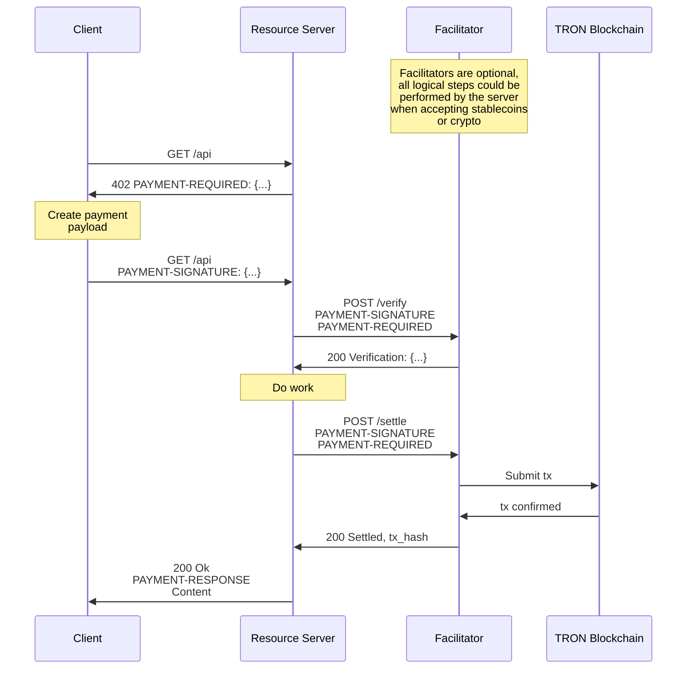

# x402-tron

x402-tron is a TRON implementation of the x402 payment protocol standard. It enables internet-native payments on the TRON blockchain with minimal integration effort.

```python
# Server example
from x402.server import X402Server
from x402.mechanisms.server import UptoTronServerMechanism

server = X402Server()
server.register_mechanism("tron:nile", UptoTronServerMechanism())

@app.get("/weather")
@server.protect(
    accepts=[{
        "scheme": "upto",
        "network": "tron:nile",
        "amount": "1000000",  # 1 USDT
        "asset": "TXYZopYRdj2D9XRtbG411XZZ3kM5VkAeBf",
        "payTo": "TDhj8uX7SVJwvhCUrMaiQHqPgrB6wRb3eG"
    }]
)
async def get_weather():
    return {"temperature": 72, "condition": "sunny"}
```

## Installation

### Python

```shell
# Install with TRON support
pip install x402-tron[tron]

# Install with FastAPI integration
pip install x402-tron[fastapi]

# Install all optional dependencies
pip install x402-tron[all]
```

### TypeScript

```shell
npm i @open-aibank/x402-tron
```

## Features

- **TRON Native**: Built specifically for TRON blockchain (Mainnet, Shasta, Nile)
- **Multiple Payment Schemes**: Support for `upto` payment scheme with extensibility for more
- **Easy Integration**: One-line server protection, simple client SDK
- **FastAPI & Flask Support**: Ready-to-use middleware for popular Python frameworks
- **TypeScript Support**: Full TypeScript SDK for client-side integration
- **Trust Minimizing**: Facilitator cannot move funds outside client intentions
- **EIP-712 Compatible**: Uses TRON's TIP-712 for secure message signing

## Quick Start

### Server (Python)

```python
from fastapi import FastAPI
from x402.server import X402Server
from x402.mechanisms.server import UptoTronServerMechanism
from x402.clients import FacilitatorClient

app = FastAPI()

# Initialize x402 server
server = X402Server()
server.register_mechanism("tron:nile", UptoTronServerMechanism())
server.set_facilitator_client(FacilitatorClient("http://localhost:8001"))

# Protect your endpoint
@app.get("/protected")
@server.protect(
    accepts=[{
        "scheme": "upto",
        "network": "tron:nile",
        "amount": "1000000",
        "asset": "TXYZopYRdj2D9XRtbG411XZZ3kM5VkAeBf",
        "payTo": "YOUR_TRON_ADDRESS"
    }]
)
async def protected_resource():
    return {"data": "secret content"}
```

### Client (TypeScript)

```typescript
import { X402Client } from '@x402-tron/core';
import { UptoTronClientMechanism } from '@x402-tron/mechanism-tron';
import { TronClientSigner } from '@x402-tron/signer-tron';

// Initialize client
const client = new X402Client();
const signer = new TronClientSigner(privateKey);
const mechanism = new UptoTronClientMechanism(signer);

client.registerMechanism('tron:*', mechanism);

// Make payment request
const response = await fetch('https://api.example.com/protected');
if (response.status === 402) {
    const paymentRequired = await response.json();
    const payload = await client.createPaymentPayload(
        paymentRequired.accepts[0],
        '/protected'
    );
    
    // Retry with payment
    const paidResponse = await fetch('https://api.example.com/protected', {
        headers: {
            'PAYMENT-SIGNATURE': btoa(JSON.stringify(payload))
        }
    });
}
```

### Facilitator (Python)

```python
from fastapi import FastAPI
from x402.facilitator import X402Facilitator
from x402.mechanisms.facilitator import UptoTronFacilitatorMechanism
from x402.signers.facilitator import TronFacilitatorSigner

app = FastAPI()

# Initialize facilitator
facilitator = X402Facilitator()
signer = TronFacilitatorSigner(private_key="YOUR_PRIVATE_KEY")
mechanism = UptoTronFacilitatorMechanism(signer=signer)

facilitator.register_mechanism("tron:nile", mechanism)

# Mount facilitator endpoints
app.include_router(facilitator.create_router(), prefix="")
```

## Architecture

The x402-tron protocol involves three parties:

- **Client**: Entity wanting to pay for a resource
- **Resource Server**: HTTP server providing protected resources
- **Facilitator**: Server that verifies and settles payments on TRON

### Payment Flow



## Supported Networks

- **TRON Mainnet** (`tron:mainnet`)
- **TRON Shasta Testnet** (`tron:shasta`)
- **TRON Nile Testnet** (`tron:nile`)

## Supported Schemes

### Upto Scheme

The `upto` scheme allows payments up to a specified amount, useful for:
- Pay-per-use APIs (LLM token generation, data processing)
- Metered resources (compute time, bandwidth)
- Dynamic pricing based on actual usage

## Project Structure

```
x402-tron/
├── python/x402/              # Python SDK
│   ├── src/x402/
│   │   ├── mechanisms/       # Payment mechanisms (client, server, facilitator)
│   │   ├── signers/          # TIP-712 signers
│   │   ├── clients/          # Facilitator client
│   │   ├── server/           # Resource server
│   │   ├── facilitator/      # Facilitator server
│   │   ├── fastapi/          # FastAPI middleware
│   │   └── utils/            # Utilities
│   └── tests/
├── typescript/packages/      # TypeScript SDK
│   ├── core/                 # Core types and client
│   ├── mechanisms/tron/      # TRON mechanisms
│   ├── signers/tron/         # TRON signers
│   └── http/                 # HTTP adapters
├── examples/                 # Example implementations
│   ├── python/
│   │   ├── client/
│   │   ├── server/
│   │   └── facilitator/
│   └── typescript/
└── e2e/                      # End-to-end tests
```

## Development

### Prerequisites

- Python 3.10+
- Node.js 18+
- pnpm

### Setup

```bash
# Install Python dependencies
cd python/x402
pip install -e .[dev]

# Install TypeScript dependencies
cd typescript
pnpm install
pnpm build
```

### Running Tests

```bash
# Python tests
cd python/x402
pytest

# TypeScript tests
cd typescript
pnpm test

# End-to-end tests
cd e2e
pytest
```

### Code Quality

```bash
# Python formatting
ruff format .

# Python linting
ruff check .

# TypeScript build
cd typescript
pnpm build
```

## Examples

See the `examples/` directory for complete working examples:

- **Python Client**: `examples/python/client/`
- **Python Server**: `examples/python/server/`
- **Python Facilitator**: `examples/python/facilitator/`
- **TypeScript Client**: `examples/typescript/client/`
- **Web Client**: `examples/typescript/client-web/`

## Contributing

We welcome contributions! Please see [CONTRIBUTING.md](./CONTRIBUTING.md) for guidelines.

### Adding New Features

- Payment schemes must be trust-minimizing
- All changes must include tests
- Follow existing code style and naming conventions
- Update documentation

## Security

- Never commit private keys or seed phrases
- Use environment variables for sensitive data
- All payments use TIP-712 signed messages
- Facilitator cannot move funds without client authorization

## License

MIT License - see [LICENSE](./LICENSE) for details

## Resources

- [TRON Documentation](https://developers.tron.network/)
- [TIP-712 Specification](https://github.com/tronprotocol/tips/blob/master/tip-712.md)

## Acknowledgments

This project is an implementation of the x402 payment protocol standard for the TRON blockchain. The x402 standard is an open protocol for internet-native payments.
