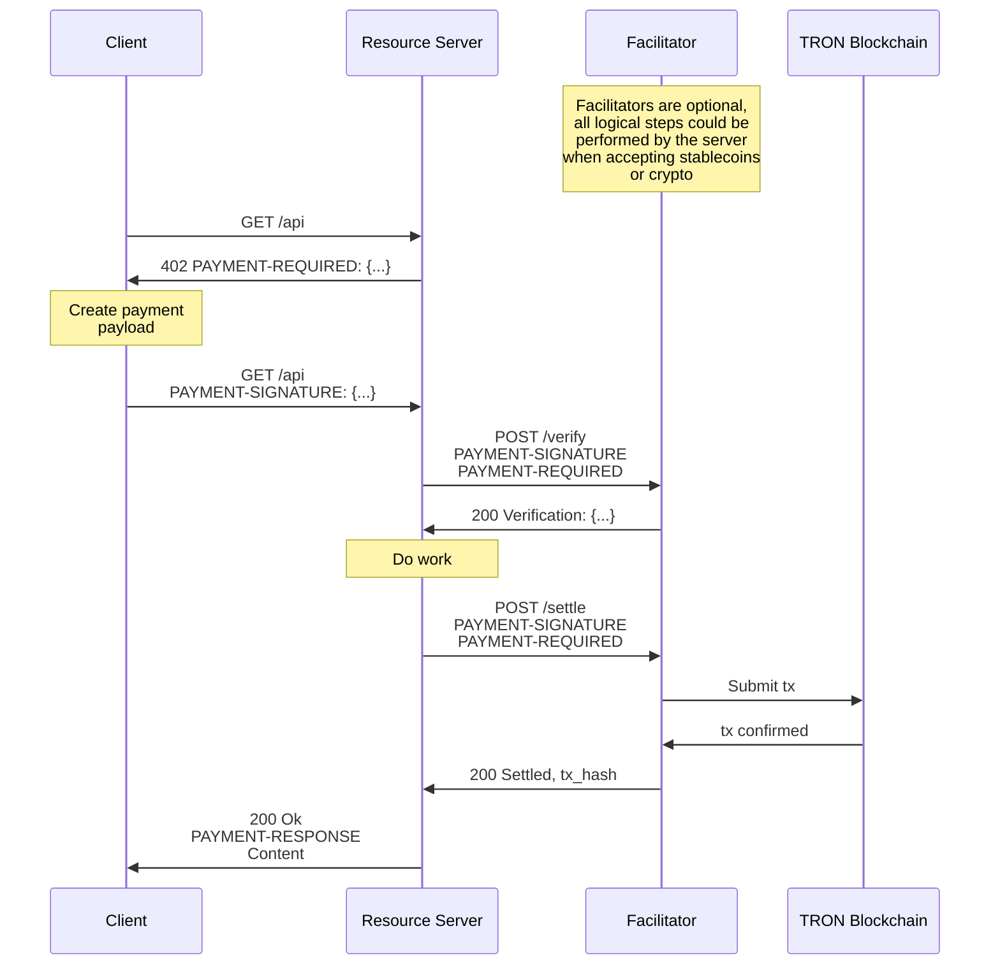

# x402-tron

x402-tron is a TRON implementation of the x402 payment protocol standard. It enables internet-native payments on the TRON blockchain with minimal integration effort.

## Installation

### Python

```shell
# Clone the repository
git clone https://github.com/open-aibank/x402-tron.git
cd x402-tron/python/x402

pip install -e .[all]
```

### TypeScript

```shell
npm i @open-aibank/x402-tron
```

## Features

- **TRON Native**: Built specifically for TRON blockchain (Mainnet, Shasta, Nile)
- **Multiple Payment Schemes**: Support for `exact` payment scheme with extensibility for more
- **Easy Integration**: One-line server protection, simple client SDK
- **FastAPI & Flask Support**: Ready-to-use middleware for popular Python frameworks
- **TypeScript Support**: Full TypeScript SDK for client-side integration
- **Trust Minimizing**: Facilitator cannot move funds outside client intentions
- **EIP-712 Compatible**: Uses TRON's TIP-712 for secure message signing

## Quick Start

### Server (Python)

```python
from fastapi import FastAPI, Request
from x402_tron.server import X402Server
from x402_tron.fastapi import x402_protected
from x402_tron.facilitator import FacilitatorClient

app = FastAPI()
server = X402Server()
server.add_facilitator(FacilitatorClient("http://localhost:8001"))

@app.get("/protected")
@x402_protected(
    server=server,
    price="1 USDT",
    network="tron:nile",
    pay_to="YOUR_TRON_ADDRESS"
)
async def protected_resource(request: Request):
    return {"data": "secret content"}
```

### Client (TypeScript)

```typescript
import { X402Client, ExactTronClientMechanism, TronClientSigner } from '@open-aibank/x402-tron';
import { TronWeb } from 'tronweb';

// Initialize client
const tronWeb = new TronWeb({
  fullHost: 'https://nile.trongrid.io',
  privateKey: 'your_private_key',
});
const signer = TronClientSigner.withPrivateKey(tronWeb, 'your_private_key', 'nile');
const client = new X402Client();
const mechanism = new ExactTronClientMechanism(signer);

client.register('tron:*', mechanism);

// Make payment request
const response = await fetch('https://api.example.com/protected');
if (response.status === 402) {
    const paymentRequired = await response.json();

    // Extract context from extensions
    const context = paymentRequired.extensions?.paymentPermitContext;

    const payload = await client.createPaymentPayload(
        paymentRequired.accepts[0],
        '/protected',
        { paymentPermitContext: context }
    );

    // Retry with payment
    const paidResponse = await fetch('https://api.example.com/protected', {
        headers: {
            'PAYMENT-SIGNATURE': btoa(JSON.stringify(payload))
        }
    });
}
```

### Facilitator (Python)

```python
from fastapi import FastAPI
from x402_tron.facilitator import X402Facilitator
from x402_tron.mechanisms.facilitator import ExactTronFacilitatorMechanism
from x402_tron.signers.facilitator import TronFacilitatorSigner
from x402_tron.types import PaymentPayload, PaymentRequirements

app = FastAPI()

# Initialize facilitator
facilitator = X402Facilitator()
signer = TronFacilitatorSigner(private_key="YOUR_PRIVATE_KEY")
mechanism = ExactTronFacilitatorMechanism(signer=signer)

facilitator.register(["tron:nile"], mechanism)

# Implement facilitator endpoints
@app.get("/supported")
async def supported():
    return facilitator.supported(fee_to=signer.get_address())

@app.post("/fee/quote")
async def fee_quote(body: dict):
    return await facilitator.fee_quote(
        PaymentRequirements(**body["accept"]),
        body.get("paymentPermitContext")
    )

@app.post("/verify")
async def verify(body: dict):
    return await facilitator.verify(
        PaymentPayload(**body["paymentPayload"]),
        PaymentRequirements(**body["paymentRequirements"])
    )

@app.post("/settle")
async def settle(body: dict):
    return await facilitator.settle(
        PaymentPayload(**body["paymentPayload"]),
        PaymentRequirements(**body["paymentRequirements"])
    )
```

## Architecture

The x402-tron protocol involves three parties:

- **Client**: Entity wanting to pay for a resource
- **Resource Server**: HTTP server providing protected resources
- **Facilitator**: Server that verifies and settles payments on TRON

### Payment Flow



## Supported Networks

- **TRON Mainnet** (`tron:mainnet`)
- **TRON Shasta Testnet** (`tron:shasta`)
- **TRON Nile Testnet** (`tron:nile`)

## Supported Schemes

### Exact Scheme

The `exact` scheme allows payments for a specified exact amount, useful for:
- Pay-per-use APIs (LLM token generation, data processing)
- Fixed-price resources
- Predictable pricing for API calls

## Project Structure

```
x402-tron/
├── python/x402/              # Python SDK
│   ├── src/x402_tron/
│   │   ├── mechanisms/       # Payment mechanisms (client, server, facilitator)
│   │   ├── signers/          # TIP-712 signers
│   │   ├── clients/          # Facilitator client
│   │   ├── server/           # Resource server
│   │   ├── facilitator/      # Facilitator server
│   │   ├── fastapi/          # FastAPI middleware
│   │   └── utils/            # Utilities
│   └── tests/
└── typescript/packages/      # TypeScript SDK
    └── x402/                 # Complete SDK package
        ├── client/           # Core client
        ├── mechanisms/       # TRON mechanisms
        ├── signers/          # TRON signers
        ├── http/             # HTTP adapters
        └── types/            # Type definitions
```

## Development

### Prerequisites

- Python 3.10+
- Node.js 18+
- pnpm

### Setup

```bash
# Install Python dependencies
cd python/x402
pip install -e .[dev]

# Install TypeScript dependencies
cd typescript
pnpm install
pnpm build
```

### Running Tests

```bash
# Python tests
cd python/x402
pytest

# TypeScript tests
cd typescript
pnpm test

# End-to-end tests
cd e2e
pytest
```

### Code Quality

```bash
# Python formatting
ruff format .

# Python linting
ruff check .

# TypeScript build
cd typescript
pnpm build
```

## Examples

For complete working examples and demos, see the separate demo repository:

**[x402-tron-demo](https://github.com/open-aibank/x402-tron-demo)**

The demo repository includes:
- Python Client examples
- Python Server examples
- Python Facilitator examples
- TypeScript Client examples
- Web Client examples

## Contributing

We welcome contributions! Please see [CONTRIBUTING.md](./CONTRIBUTING.md) for guidelines.

### Adding New Features

- Payment schemes must be trust-minimizing
- All changes must include tests
- Follow existing code style and naming conventions
- Update documentation

## Security

- Never commit private keys or seed phrases
- Use environment variables for sensitive data
- All payments use TIP-712 signed messages
- Facilitator cannot move funds without client authorization

## License

MIT License - see [LICENSE](./LICENSE) for details

## Resources

- [TRON Documentation](https://developers.tron.network/)
- [TIP-712 Specification](https://github.com/tronprotocol/tips/blob/master/tip-712.md)

## Acknowledgments

This project is an implementation of the x402 payment protocol standard for the TRON blockchain. The x402 standard is an open protocol for internet-native payments.
