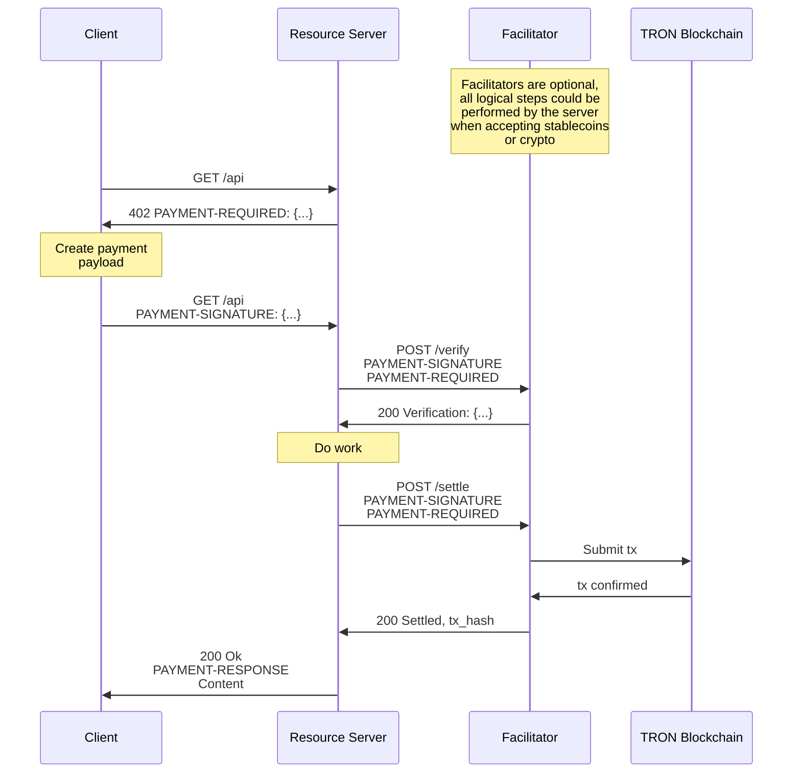

# x402-tron

x402-tron is the TRON blockchain implementation of the **x402 open payment standard**. It turns the HTTP `402 Payment Required` status code into a programmable, accountless payment layer for APIs, digital content, and AI agents.

by leveraging TRON's high speed and low fees, x402-tron enables friction-free, machine-to-machine commerce without API keys, subscriptions, or sign-ups.

---

**[📚 Full Documentation](https://x402-tron-docs.bankofai.io/)** | **[💻 Demo Repository](https://github.com/bankofai/x402-tron-demo)**

---

## Features

- **Protocol Native**: Restores the HTTP `402` status code to its intended purpose.
- **AI Ready**: First-class support for AI Agents via specialized x402 skills.
- **Trust Minimized**: Uses TRON's **TIP-712** structured data signing. Facilitators cannot modify payment terms.
- **Stateless & Accountless**: No user accounts or session management required. Payments are verified per request.
- **Framework Integrations**: 
    - **Python**: FastAPI, Flask, httpx
    - **TypeScript**: Native fetch, Node.js
- **Broad Network Support**: TRON Mainnet, Nile (Testnet), and Shasta.

## Installation

### Python
The Python SDK includes support for Server (FastAPI/Flask), Client, and Facilitator.

```bash
# Clone the repository
git clone https://github.com/bankofai/x402-tron.git
cd x402-tron/python/x402

# Install with all dependencies
pip install -e .[all]
```

### TypeScript
The TypeScript SDK provides client-side integration tools.

```bash
npm install @bankofai/x402-tron
```

## AI Agent Integration

x402-tron is designed for the Agentic Web. AI agents can autonomously negotiate and pay for resources using the [**x402-tron-payment**](https://github.com/bankofai/skills-tron/tree/main/x402_tron_payment) skill.

This skill enables agents to:

1. Detect `402 Payment Required` responses.
2. Sign TIP-712 payment authorizations automatically.
3. Manage wallet balances and handle the challenge-response loop.

## Quick Start

### 1. Facilitator
The Facilitator is responsible for verifying TIP-712 signatures and executing on-chain settlements.

- **Self-Hosted**: Developers currently need to deploy their own facilitator instance. Detailed deployment instructions can be found in the [**demo repository quick start**](https://github.com/bankofai/x402-tron-demo/tree/main?tab=readme-ov-file#quick-start).
- **Official Facilitator**: An official, hosted facilitator service is **coming soon**, which will eliminate the need for server-side blockchain infrastructure.

### 2. Server (Seller)
Protect your FastAPI endpoints with a single decorator.

```python
from fastapi import FastAPI, Request
from x402_tron.server import X402Server
from x402_tron.fastapi import x402_protected
from x402_tron.facilitator import FacilitatorClient

app = FastAPI()
server = X402Server()
# Use a local or hosted facilitator
server.set_facilitator(FacilitatorClient("http://localhost:8001"))

@app.get("/protected")
@x402_protected(
    server=server,
    prices=["1 USDT"],
    schemes=["exact"],
    network="tron:nile",
    pay_to="<YOUR_WALLET_ADDRESS>",
)
async def protected_resource(request: Request):
    return {"data": "This content was paid for on TRON"}
```

### 3. Client (Buyer)
Clients handle the `402` challenge-response loop automatically using the SDK.

**TypeScript Example:**
```typescript
import { X402Client, X402FetchClient, ExactTronClientMechanism, TronClientSigner } from '@bankofai/x402-tron';
import { TronWeb } from 'tronweb';

// Setup TronWeb and Signer
const tronWeb = new TronWeb({ fullHost: 'https://nile.trongrid.io', privateKey: '...' });
const signer = TronClientSigner.withPrivateKey(tronWeb, '...', 'nile');

// Register Mechanism and create Fetch Client
const x402Client = new X402Client()
  .register('tron:*', new ExactTronClientMechanism(signer));
const client = new X402FetchClient(x402Client);

// The SDK handles the 402 flow automatically
// If you don't want to deploy a facilitator and server, you can use the official demo service: https://x402-tron-demo.bankofai.io/protected-nile
// Ensure your account has USDT and a small amount of TRX for the initial approval gas fee.
const response = await client.get('http://localhost:8000/protected');
const data = await response.json();
```

### 4. Agent (Buyer)
AI agents can handle x402 payments autonomously by using the specialized payment skill.

**Configuration:**
Set your wallet credentials in the environment. The `TRON_GRID_API_KEY` is recommended to avoid rate limits on TRON RPC nodes.

```bash
# Set your wallet and network credentials
export TRON_PRIVATE_KEY="your_private_key_here"
export TRON_GRID_API_KEY="your_trongrid_api_key_here"  # Recommended
```

**Using with Agentic Tools:**
You can add the [**x402-tron-payment**](https://github.com/bankofai/skills-tron/tree/main/x402_tron_payment) skill to your favorite agentic tools:

- **OpenClaw**: `npx clawhub install x402-tron-payment`
- **opencode**: Copy the skill to your project's `.opencode/skill/` directory to enable autonomous TRON payments.

Once configured, your agent will:
1. Automatically detect when an API requires payment (`402`).
2. Negotiate terms and sign authorizations using the provided wallet.
3. Manage gas (TRX) and token (USDT/USDD) balances to ensure smooth operation.

**Try it out:** Tell your Agent to visit `https://x402-tron-demo.bankofai.io/protected-nile`. The Agent will automatically complete the x402 payment and return the resource.

## Architecture

The x402-tron protocol involves three parties:

- **Client**: Entity wanting to pay for a resource
- **Resource Server**: HTTP server providing protected resources
- **Facilitator**: Server that verifies and settles payments on TRON

### Payment Flow



## Supported Networks & Assets

x402-tron supports TRC-20 tokens. Custom tokens can be registered via the `TokenRegistry`.

| Network | ID | Status | Recommended For |
|---------|----|--------|-----------------|
| **TRON Nile** | `tron:nile` | Testnet | **Development & Testing** |
| **TRON Shasta** | `tron:shasta` | Testnet | Alternative Testing |
| **TRON Mainnet** | `tron:mainnet` | Mainnet | Production |

**Supported Tokens:**
- **USDT** (Tether)
- **USDD** (Decentralized USD)

## Development

### Prerequisites
- Python 3.10+
- Node.js 18+
- A TRON Wallet (e.g., TronLink) with TRX for gas/energy.

### Configuration
Environment variables for development:
- `TRON_GRID_API_KEY`: Recommended for higher RPC limits.
- `TRON_PRIVATE_KEY`: Required for signing operations (Client/Facilitator).

### Testing
```bash
# Run Python tests
cd python/x402 && pytest

# Run TypeScript tests
cd typescript && pnpm test
```

## Security & Risk

> [!WARNING]
> **Use at your own risk.** Handling private keys involves significant risk of asset loss.
>
> - **Never commit secrets**: Do not hardcode private keys or commit `.env` files to version control.
> - **Wallet Isolation**: Use dedicated wallets for development with only necessary funds.
> - **Environment Variables**: Always use environment variables or secure vaults to manage sensitive credentials.
> - **Protocol Status**: x402-tron is in active development. Ensure you test thoroughly on Nile or Shasta testnets before any mainnet deployment.

## Contributing

We welcome contributions! Please see [CONTRIBUTING.md](./CONTRIBUTING.md) for guidelines.

## License

MIT License - see [LICENSE](./LICENSE) for details.
