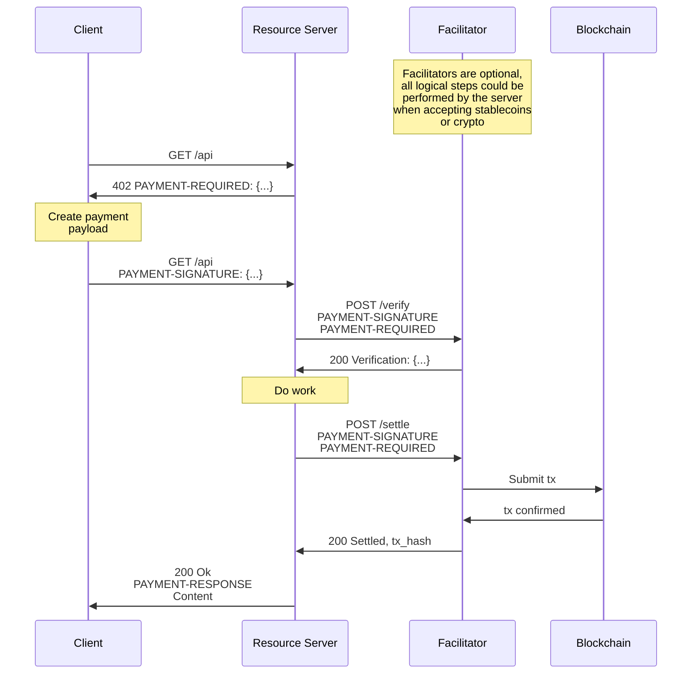

# x402

x402 is an open-source SDK for the [**x402 open payment standard**](https://www.x402.org/) — a protocol built on the HTTP `402 Payment Required` status code. It enables web services to charge for APIs or content through a "pay-before-response" mechanism — without relying on traditional account systems or session management.

x402 currently supports the **TRON** and **BSC** networks, with plans to expand to a broader multi-chain ecosystem in the future.

---

**[📚 Full Documentation](https://x402-docs.bankofai.io/)** | **[💻 Demo Repository](https://github.com/bankofai/x402-demo)**

---

## Features

- **Protocol Native**: Restores the HTTP `402` status code to its intended purpose.
- **AI Ready**: First-class support for AI Agents via specialized x402 skills.
- **Trust Minimized**: Uses **TIP-712/EIP-712** structured data signing. Facilitators cannot modify payment terms.
- **Stateless & Accountless**: No user accounts or session management required. Payments are verified per request.
- **Framework Integrations**: 
    - **Python**: FastAPI, Flask, httpx
    - **TypeScript**: Native fetch, Node.js

## Installation

### Python
The Python SDK includes support for Server (FastAPI/Flask), Client, and Facilitator.

```bash
# Clone the repository
git clone https://github.com/bankofai/x402.git
cd x402/python/x402

# Install with all dependencies
pip install -e .[all]
```

### TypeScript
The TypeScript SDK provides client-side integration tools.

```bash
npm install @bankofai/x402
```

## AI Agent Integration

x402 is designed for the Agentic Web. AI agents can autonomously negotiate and pay for resources using the [**x402-payment**](https://github.com/bankofai/skills/tree/main/x402-payment) skill.

This skill enables agents to:

1. Detect `402 Payment Required` responses.
2. Sign TIP-712/EIP-712 payment authorizations automatically.
3. Manage wallet balances and handle the challenge-response loop.

## Quick Start

### 1. Facilitator
The Facilitator is responsible for verifying TIP-712/EIP-712 signatures and executing on-chain settlements.

- **Self-Hosted**: Deploy and manage your own Facilitator instance for full control over fee policies and settlement strategies. See the [**demo repository quick start**](https://github.com/bankofai/x402-demo/tree/main?tab=readme-ov-file#quick-start) for deployment instructions.
- **Official Facilitator**: An [officially hosted Facilitator](https://github.com/bankofai/x402-facilitator) service is available, allowing you to use x402 without deploying infrastructure yourself.

### 2. Server (Seller)
Protect your FastAPI endpoints with a single decorator.

**TRON Example:**
```python
from fastapi import FastAPI
from bankofai.x402.server import X402Server
from bankofai.x402.fastapi import x402_protected
from bankofai.x402.facilitator import FacilitatorClient
from bankofai.x402.config import NetworkConfig

app = FastAPI()
server = X402Server()
server.set_facilitator(FacilitatorClient("http://localhost:8001"))

@app.get("/protected")
@x402_protected(
    server=server,
    prices=["0.0001 USDT"],
    schemes=["exact_permit"],
    network=NetworkConfig.TRON_NILE,
    pay_to="<YOUR_TRON_WALLET_ADDRESS>",
)
async def protected_endpoint():
    return {"data": "This is premium content!"}
```

**EVM (BSC) Example:**
```python
from fastapi import FastAPI
from bankofai.x402.server import X402Server
from bankofai.x402.fastapi import x402_protected
from bankofai.x402.facilitator import FacilitatorClient
from bankofai.x402.config import NetworkConfig
from bankofai.x402.mechanisms.evm.exact_permit import ExactPermitEvmServerMechanism
from bankofai.x402.mechanisms.evm.exact import ExactEvmServerMechanism

app = FastAPI()
server = X402Server()
server.register(NetworkConfig.BSC_TESTNET, ExactPermitEvmServerMechanism())
server.register(NetworkConfig.BSC_TESTNET, ExactEvmServerMechanism())
server.set_facilitator(FacilitatorClient("http://localhost:8001"))

@app.get("/protected")
@x402_protected(
    server=server,
    prices=["0.0001 USDT"],
    schemes=["exact_permit"],
    network=NetworkConfig.BSC_TESTNET,
    pay_to="<YOUR_BSC_WALLET_ADDRESS>",
)
async def protected_endpoint():
    return {"data": "This is premium content!"}
```

### 3. Client (Buyer)
Clients handle the `402` challenge-response loop automatically using the SDK.

**TRON — TypeScript Example:**
```typescript
import 'dotenv/config'
import {
  X402Client, X402FetchClient,
  ExactPermitTronClientMechanism, TronClientSigner,
  SufficientBalancePolicy,
} from '@bankofai/x402'

const TRON_PRIVATE_KEY = process.env.TRON_PRIVATE_KEY!

const signer = new TronClientSigner(TRON_PRIVATE_KEY)

const x402 = new X402Client()
x402.register('tron:*', new ExactPermitTronClientMechanism(signer))
x402.registerPolicy(SufficientBalancePolicy)

const client = new X402FetchClient(x402)

// The SDK handles the 402 flow automatically
// Demo service: https://x402-demo.bankofai.io/protected-nile
const response = await client.get('http://localhost:8000/protected')
const data = await response.json()
```

**EVM (BSC) — TypeScript Example:**
```typescript
import 'dotenv/config'
import {
  X402Client, X402FetchClient,
  ExactPermitEvmClientMechanism, ExactEvmClientMechanism,
  EvmClientSigner, SufficientBalancePolicy,
} from '@bankofai/x402'

const BSC_PRIVATE_KEY = process.env.BSC_PRIVATE_KEY!

const signer = new EvmClientSigner(BSC_PRIVATE_KEY)

const x402 = new X402Client()
x402.register('eip155:*', new ExactPermitEvmClientMechanism(signer))
x402.register('eip155:*', new ExactEvmClientMechanism(signer))
x402.registerPolicy(SufficientBalancePolicy)

const client = new X402FetchClient(x402)

// The SDK handles the 402 flow automatically
// Demo service: https://x402-demo.bankofai.io/protected-bsc-testnet
const response = await client.get('http://localhost:8000/protected')
const data = await response.json()
```

### 4. Agent (Buyer)
AI agents can handle x402 payments autonomously by using the specialized payment skill.

**Configuration:**
Set your wallet credentials in the environment. The `TRON_GRID_API_KEY` is recommended to avoid rate limits on TRON RPC nodes.

```bash
# Set your wallet and network credentials
export TRON_PRIVATE_KEY="your_private_key_here"
export TRON_GRID_API_KEY="your_trongrid_api_key_here"  # Recommended
```

**Using with Agentic Tools:**
You can add the [**x402-payment**](https://github.com/bankofai/skills/tree/main/x402-payment) skill to your favorite agentic tools:

- **OpenClaw**: `npx clawhub install x402-payment`
- **opencode**: Copy the skill to your project's `.opencode/skill/` directory to enable autonomous TRON payments.

Once configured, your agent will:
1. Automatically detect when an API requires payment (`402`).
2. Negotiate terms and sign authorizations using the provided wallet.
3. Manage gas (TRX) and token (USDT/USDD) balances to ensure smooth operation.

**Try it out:** Tell your Agent to visit `https://x402-demo.bankofai.io/protected-nile`. The Agent will automatically complete the x402 payment and return the resource.

## Architecture

The x402 protocol involves three parties:

- **Client**: Entity wanting to pay for a resource
- **Resource Server**: HTTP server providing protected resources
- **Facilitator**: Server that verifies and settles payments on-chain

### Payment Flow



## Supported Networks & Assets

x402 currently supports TRC-20 tokens on the TRON network and BEP-20 tokens on the BSC network. Custom tokens can be registered via the `TokenRegistry`.

| Network | ID | Status | Recommended For |
|---------|----|--------|-----------------|
| **TRON Nile** | `tron:nile` | Testnet | **Development & Testing** |
| **TRON Shasta** | `tron:shasta` | Testnet | Alternative Testing |
| **TRON Mainnet** | `tron:mainnet` | Mainnet | Production |
| **BSC Testnet** | `eip155:97` | Testnet | **Development & Testing** |
| **BSC Mainnet** | `eip155:56` | Mainnet | Production |

**Supported Tokens:**
- **USDT** (Tether)
- **USDD** (Decentralized USD)

## Development

### Prerequisites
- Python 3.10+
- Node.js 18+
- A TRON Wallet (e.g., TronLink) with TRX for gas/energy, and/or a BSC Wallet (e.g., MetaMask) with BNB for gas.

### Configuration
Environment variables for development:
- `TRON_PRIVATE_KEY`: Required for TRON signing operations (Client/Facilitator).
- `TRON_GRID_API_KEY`: Recommended for higher TRON RPC limits.
- `BSC_PRIVATE_KEY`: Required for BSC signing operations (Client/Facilitator).

### Testing
```bash
# Run Python tests
cd python/x402 && pytest

# Run TypeScript tests
cd typescript && pnpm test
```

## Security & Risk

> [!WARNING]
> **Use at your own risk.** Handling private keys involves significant risk of asset loss.
>
> - **Never commit secrets**: Do not hardcode private keys or commit `.env` files to version control.
> - **Wallet Isolation**: Use dedicated wallets for development with only necessary funds.
> - **Environment Variables**: Always use environment variables or secure vaults to manage sensitive credentials.
> - **Protocol Status**: x402 is in active development. Ensure you test thoroughly on Nile or Shasta testnets before any mainnet deployment.

## Contributing

We welcome contributions! Please see [CONTRIBUTING.md](./CONTRIBUTING.md) for guidelines.

## License

MIT License - see [LICENSE](./LICENSE) for details.
