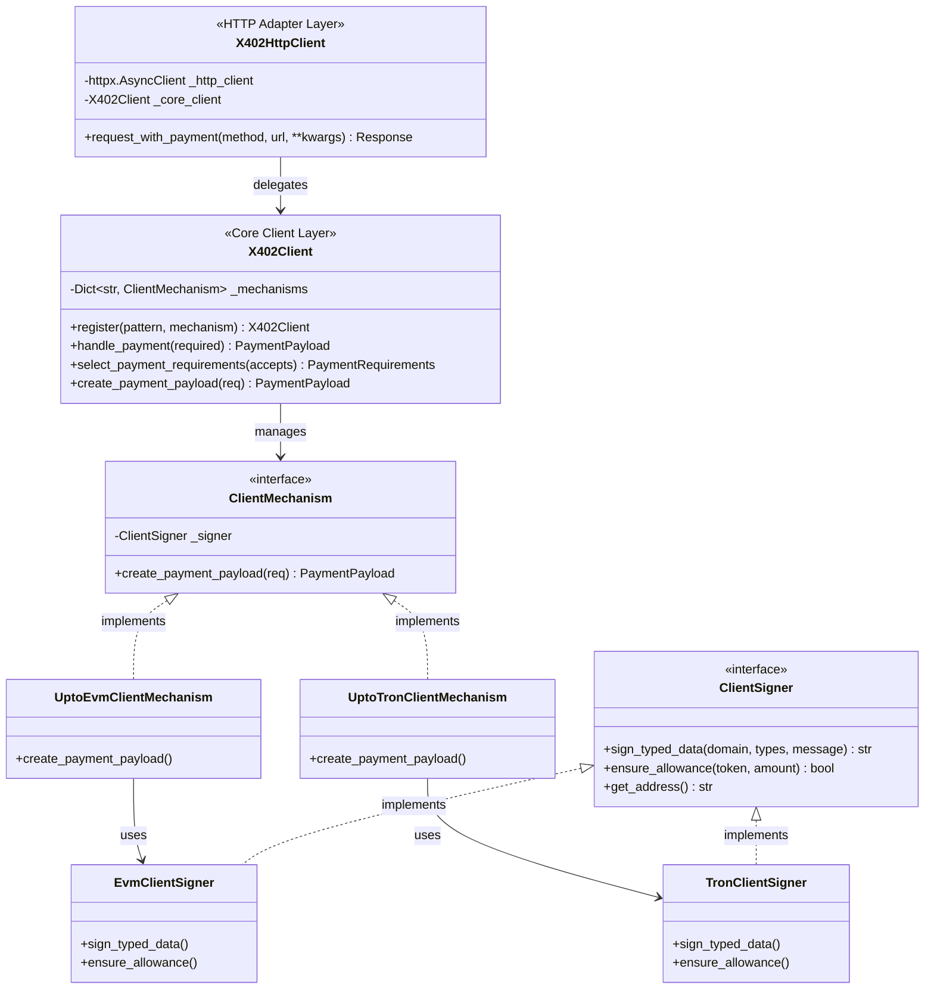
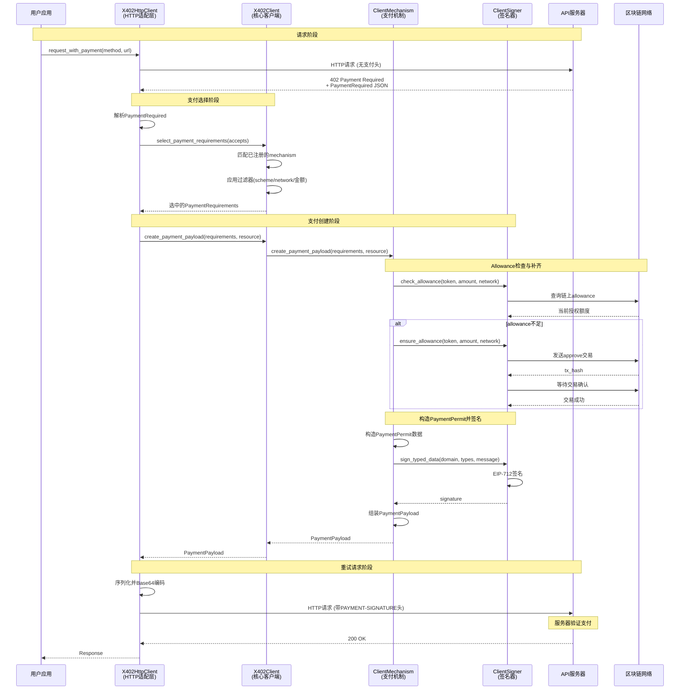

# Client SDK 详细文档

## 概述

Client SDK 提供了完整的支付客户端功能，支持自动处理 402 支付流程、多链支付、allowance 管理等。

**核心能力：**
- 自动识别 `402 Payment Required` 并完成支付后重试
- 支持多链支付（EVM、TRON、Solana）
- 自动管理 token allowance（授权额度）
- 可插拔的支付机制和签名器

---

## Client SDK 使用示例

### 基础使用流程

```python
import httpx
from tron_x402.client import X402Client
from tron_x402.http import X402HttpClient
from tron_x402.mechanisms.tron import UptoTronClientMechanism
from tron_x402.signers.tron import TronClientSigner

# 1. 创建 signer（签名器）
signer = TronClientSigner.from_private_key("your_private_key")

# 2. 创建 X402Client 并注册支付机制
x402_client = (
    X402Client()
    .register("tron:*", UptoTronClientMechanism(signer))  # 支持所有 TRON 网络
    .register("eip155:*", UptoEvmClientMechanism(evm_signer))  # 支持所有 EVM 网络
)

# 3. 包装 httpx.AsyncClient，所有请求自动处理 402 支付
async with httpx.AsyncClient(timeout=30) as raw_client:
    paid_client = X402HttpClient(raw_client, x402_client)
    
    # 4. 发起请求，自动处理支付
    resp = await paid_client.request_with_payment(
        method="GET",
        url="https://api.example.com/premium-data",
    )
    print(resp.status_code, resp.json())
```

### 自定义支付选择器

```python
# 定义自定义支付选择器（优先选择 TRON 网络）
def prefer_tron_network_selector(requirements):
    """优先选择 TRON 网络的支付方案"""
    for req in requirements:
        if req.GetNetwork().startswith("tron:"):
            return req
    return requirements[0]

# 使用自定义选择器
paid_client = X402HttpClient(
    raw_client, 
    x402_client,
    selector=prefer_tron_network_selector
)
```

---

## 概念模型
### X402HttpClient - HTTP 客户端适配器

**职责：** HTTP 客户端适配，自动处理 402 支付流程。

**核心能力：**
- 拦截 402 响应
- 调用 X402Client 创建支付
- 重试请求并添加支付头
- 支持异步和同步两种模式
### X402Client - 核心支付客户端

**职责：** 管理支付机制注册表，协调支付流程。

**核心能力：**
- **机制注册**：`register(network_pattern, mechanism)` 支持精确网络和通配符（如 `eip155:*`），最具体的规则优先
- **支付要求选择**：`select_payment_requirements(accepts, filters)` 依据 scheme/network/金额限制挑选合规的 PaymentRequirements
- **支付创建**：`create_payment_payload(requirements, resource, extensions)` 调用机制 → mechanism 调 signer → signer 自动完成 allowance 检查与补齐


### ClientMechanism - 客户端支付机制

**职责：** 实现特定支付方案（如 upto）在特定链上的客户端逻辑。

**核心能力：**
- 根据 PaymentRequirements 创建 PaymentPayload
- 调用 ClientSigner 完成签名
- 处理链特定的支付逻辑

**实现：** `UptoEvmClientMechanism`、`UptoTronClientMechanism`、`UptoSolanaClientMechanism`

**位置：** 作为基础组件，位于 `x402/mechanisms/client/` 目录，可被多个 SDK 共享

### ClientSigner - 客户端签名器

**职责：** 处理链特定的签名和区块链交互。

**核心能力：**
- 签名支付负载以授权转账
- 检查和管理 token allowance（授权额度）
- 提供账户地址信息

**实现：** `EvmClientSigner`、`TronClientSigner`、`SolanaClientSigner`

**位置：** 作为基础组件，位于 `x402/signers/client/` 目录，可被多个 SDK 共享



## 核心类接口定义

### X402HttpClient - HTTP 客户端适配器

```python
import httpx
from typing import Optional, Callable

class X402HttpClient:
    """
    HTTP 客户端适配器，自动处理 402 支付流程
    
    职责：
    - 包装 httpx.AsyncClient，拦截 402 响应
    - 自动调用 X402Client 创建支付
    - 重试请求并添加支付头
    """
    
    def __init__(
        self,
        http_client: httpx.AsyncClient,
        x402_client: X402Client,
        selector: Optional[PaymentRequirementsSelector] = None
    ):
        """
        初始化 HTTP 客户端适配器
        
        Args:
            http_client: httpx.AsyncClient 实例
            x402_client: X402Client 实例
            selector: 自定义支付要求选择器（可选）
        """
        self._http_client = http_client
        self._x402_client = x402_client
        self._selector = selector
    
    async def request_with_payment(
        self,
        method: str,
        url: str,
        **kwargs
    ) -> httpx.Response:
        """
        发起支持自动支付的 HTTP 请求
        
        Args:
            method: HTTP 方法（GET, POST, etc.）
            url: 请求 URL
            **kwargs: 其他 httpx 请求参数
        
        Returns:
            httpx.Response: HTTP 响应
        
        流程：
            1. 发起原始请求
            2. 如果收到 402，解析 PaymentRequired
            3. 创建支付负载
            4. 重试请求并添加 PAYMENT-SIGNATURE header
        """
        pass
```

### X402Client - 核心支付客户端

```python
from typing import Dict, List, Optional, Callable
from abc import ABC, abstractmethod

class X402Client:
    """
    核心支付客户端，管理支付机制注册表，协调支付流程
    
    职责：
    - 管理多个区块链网络的支付机制
    - 根据 PaymentRequirements 选择合适的支付方案
    - 创建支付负载（PaymentPayload）
    """
    
    def __init__(self):
        """初始化客户端，创建空的机制注册表"""
        self._mechanisms: Dict[str, ClientMechanism] = {}
    
    def register(self, network_pattern: str, mechanism: 'ClientMechanism') -> 'X402Client':
        """
        注册支付机制到指定网络
        
        Args:
            network_pattern: 网络标识模式，支持精确匹配和通配符
                           例如: "eip155:1" (精确), "eip155:*" (通配符), "tron:*"
            mechanism: 支付机制实现（ClientMechanism 实例）
        
        Returns:
            self: 支持链式调用
        
        Example:
            client = X402Client()
            client.register("eip155:*", UptoEvmClientMechanism(evm_signer))
            client.register("tron:*", UptoTronClientMechanism(tron_signer))
        """
        pass
    
    def select_payment_requirements(
        self, 
        accepts: List['PaymentRequirements'],
        filters: Optional[Dict] = None
    ) -> 'PaymentRequirements':
        """
        从多个支付要求中选择最合适的一个
        
        Args:
            accepts: 服务器提供的支付要求列表
            filters: 过滤条件（scheme、network、max_value 等）
        
        Returns:
            选中的 PaymentRequirements
        
        Raises:
            UnsupportedSchemeException: 没有支持的支付方案
        """
        pass
    
    def create_payment_payload(
        self,
        requirements: 'PaymentRequirements',
        resource: str,
        extensions: Optional[Dict] = None
    ) -> 'PaymentPayload':
        """
        创建支付负载
        
        Args:
            requirements: 选中的支付要求
            resource: 请求的资源 URL
            extensions: 扩展信息（如 paymentPermitContext）
        
        Returns:
            PaymentPayload: 包含签名的支付负载
        
        Raises:
            NetworkNotSupportedError: 网络不支持
            PaymentError: 支付创建失败
        """
        pass
```

### ClientMechanism - 支付机制接口

```python
from abc import ABC, abstractmethod
from typing import Dict, Optional

class ClientMechanism(ABC):
    """
    客户端支付机制接口
    
    职责：
    - 为特定网络创建支付负载
    - 验证支付要求的有效性
    - 调用 Signer 进行签名
    """
    
    def __init__(self, signer: 'ClientSigner'):
        """
        初始化机制
        
        Args:
            signer: 客户端签名器实例
        """
        self._signer = signer
    
    @abstractmethod
    def scheme(self) -> str:
        """
        返回支付方案名称
        
        Returns:
            方案名称，如 "upto", "exact"
        """
        pass
    
    @abstractmethod
    def create_payment_payload(
        self,
        requirements: 'PaymentRequirements',
        resource: str,
        extensions: Optional[Dict] = None
    ) -> 'PaymentPayload':
        """
        创建支付负载
        
        Args:
            requirements: 支付要求
            resource: 请求的资源 URL
            extensions: 扩展信息（如 paymentPermitContext）
        
        Returns:
            PaymentPayload: 包含签名的支付负载
        
        流程：
            1. 验证网络是否支持
            2. 检查并确保 token allowance 充足
            3. 构造 PaymentPermit 数据结构
            4. 调用 signer.sign_typed_data() 进行 EIP-712 签名
            5. 生成完整的 PaymentPayload
        """
        pass
```

### ClientSigner - 签名器接口

```python
from abc import ABC, abstractmethod
from typing import Dict, Optional

class ClientSigner(ABC):
    """
    客户端签名器接口
    
    职责：
    - 提供账户地址
    - 对消息和结构化数据进行签名
    - 管理 token allowance（授权额度）
    """
    
    @abstractmethod
    def get_address(self) -> str:
        """
        获取签名者的账户地址
        
        Returns:
            账户地址（链特定格式：EVM 0x、TRON T、Solana Base58）
        """
        pass
    
    @abstractmethod
    def sign_message(self, message: bytes) -> str:
        """
        对原始消息进行签名
        
        Args:
            message: 原始消息字节
        
        Returns:
            签名字符串（十六进制或 Base58）
        
        签名协议：
            - EVM/TRON: ECDSA
            - Solana: Ed25519
        """
        pass
    
    @abstractmethod
    def sign_typed_data(
        self,
        domain: Dict,
        types: Dict,
        message: Dict
    ) -> str:
        """
        对结构化数据进行 EIP-712/Ed25519 签名
        
        Args:
            domain: EIP-712 域信息
            types: 类型定义
            message: 消息内容
        
        Returns:
            签名字符串
        
        用途：
            支付授权、交易签名（x402 主要用途）
        
        签名协议：
            - EVM/TRON: EIP-712
            - Solana: Ed25519
        """
        pass
    
    @abstractmethod
    def check_allowance(
        self,
        token: str,
        amount: int,
        network: str
    ) -> int:
        """
        检查 token 合约授权额度
        
        Args:
            token: token 合约地址
            amount: 需要的金额
            network: 网络标识
        
        Returns:
            当前授权额度
        
        链特定实现：
            - EVM: allowance(owner, spender)
            - TRON: tronpy trigger
            - Solana: 查询 Token Account
        """
        pass
    
    @abstractmethod
    def ensure_allowance(
        self,
        token: str,
        amount: int,
        network: str,
        mode: str = "auto"
    ) -> bool:
        """
        确保授权额度充足，不足时补齐
        
        Args:
            token: token 合约地址
            amount: 需要的金额
            network: 网络标识
            mode: 授权模式 ("auto", "interactive", "skip")
        
        Returns:
            是否成功确保授权
        
        模式说明：
            - auto: 自动发起 approve 交易
            - interactive: 回调 UI 让用户确认
            - skip: 跳过检查，直接返回
        """
        pass
    
    @abstractmethod
    def wait_for_approval(
        self,
        token: str,
        network: str
    ) -> bool:
        """
        等待授权交易确认
        
        Args:
            token: token 合约地址
            network: 网络标识
        
        Returns:
            授权是否成功
        
        实现：
            轮询 tx_receipt / get_transaction_info
        """
        pass
```
---

## 核心功能时序图

### 核心支付流程时序图



### 关键流程说明

#### 1. **请求阶段**
- 用户通过 `X402HttpClient` 发起常规请求。
- 服务器识别需要支付，返回 `402 Payment Required` 状态码及支付要求。

#### 2. **支付选择阶段**
- `X402HttpClient` 委托 `X402Client` 从服务器提供的方案中选择。
- `X402Client` 根据本地已注册的支付机制（Mechanism）进行匹配和过滤。

#### 3. **支付创建阶段**
- **Allowance检查**：`ClientMechanism` 协调 `ClientSigner` 检查链上授权额度，必要时自动补齐（Approve）。
- **签名授权**：`ClientMechanism` 构造符合协议的 `PaymentPermit`，由 `ClientSigner` 完成私钥签名。
- **Payload组装**：生成包含签名和支付参数的 `PaymentPayload`。

#### 4. **重试请求阶段**
- `X402HttpClient` 自动将支付负载放入 HTTP Header 中重新发起请求。
- 服务器验证签名通过后，返回业务数据。

---
