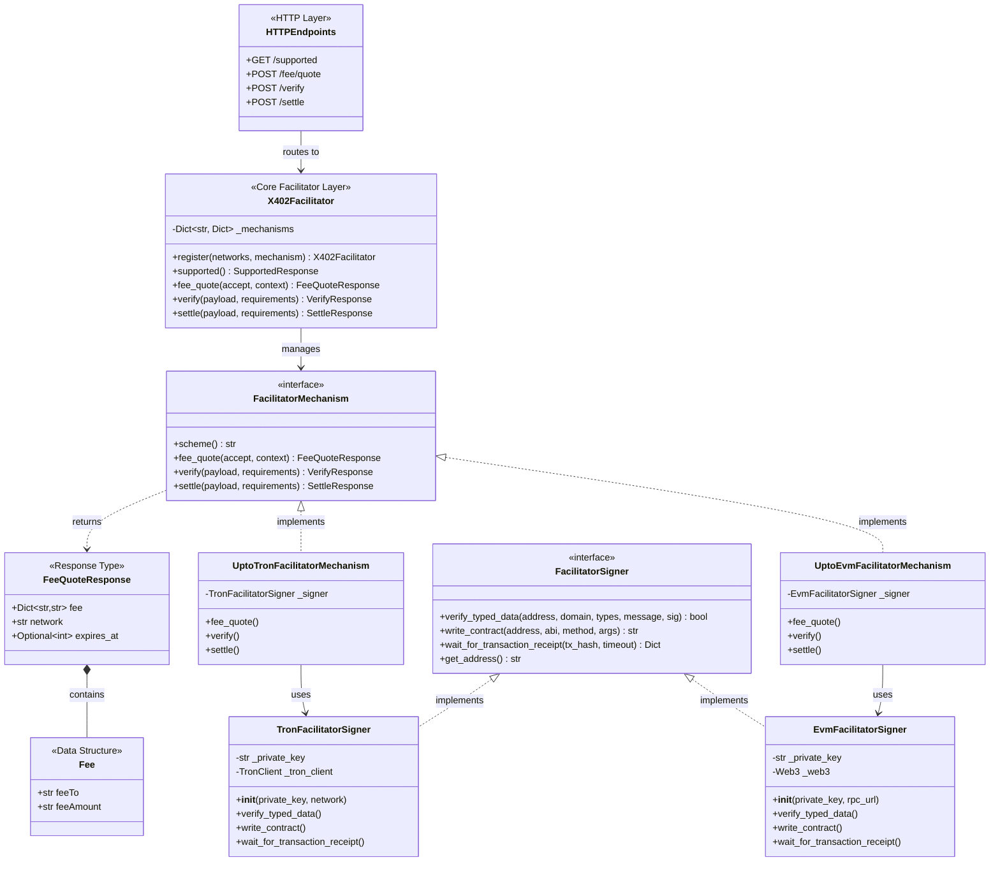
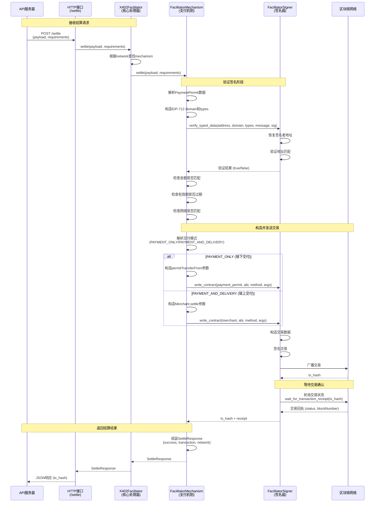

# Facilitator SDK 详细文档

## 概述

Facilitator SDK 提供了完整的支付促进者功能，负责验证支付签名、执行链上结算、计算手续费等。

**核心能力：**
- 验证客户端提交的支付签名（EIP-712/Ed25519）
- 执行链上结算交易（调用智能合约）
- 计算和报价手续费
- 支持多链（EVM、TRON、Solana）

---

## 使用示例

### Server 端调用 Facilitator Client

```python
from tron_x402.facilitator import FacilitatorClient

# 初始化 Facilitator Client
facilitator_client = FacilitatorClient(
    base_url="https://facilitator.example.com",
    headers={"Authorization": "Bearer <token>"}
)

# 1. 查询支持的能力
response = await facilitator_client.supported()
# response.kinds = [
#   {"x402Version": 2, "scheme": "upto", "network": "eip155:8453"},
#   {"x402Version": 2, "scheme": "upto", "network": "tron:mainnet"},
# ]

# 2. 查询手续费报价
fee_quote = await facilitator_client.fee_quote(
    accept=payment_requirements,
    context={"paymentPermitContext": {...}}
)
# fee_quote.fee = {"amount": 1000000, "asset": "0x...", "decimals": 6}

# 3. 验证支付（不发交易）
verify_result = await facilitator_client.verify(
    payment_payload=payment_payload,
    payment_requirements=payment_requirements
)
# verify_result.is_valid = True/False

# 4. 结算支付（发送链上交易）
settle_result = await facilitator_client.settle(
    payment_payload=payment_payload,
    payment_requirements=payment_requirements
)
# settle_result.transaction = "0x1234..."
# settle_result.network = "eip155:8453"
```

---

## 概念模型
### X402Facilitator - 核心支付处理器

**职责：** 管理支付机制注册表，协调验证和结算流程。

**核心能力：**
- **机制注册**：`register(networks, mechanism)` 注册支付机制到多个网络
- **能力声明**：`supported()` 返回支持的 network/scheme 组合
- **手续费报价**：`fee_quote(accept, context)` 计算手续费
- **支付验证**：`verify(payload, requirements)` 验证签名和有效性（不发交易）
- **支付结算**：`settle(payload, requirements)` 执行链上交易结算

### FacilitatorMechanism - Facilitator 支付机制

**职责：** 实现特定支付方案（如 upto）在特定链上的 facilitator 逻辑。

**核心能力：**
- 计算和报价手续费
- 验证支付签名（调用 FacilitatorSigner）
- 执行链上结算（调用 FacilitatorSigner）

**实现：** `UptoEvmFacilitatorMechanism`、`UptoTronFacilitatorMechanism`、`UptoSolanaFacilitatorMechanism`

**位置：** 作为基础组件，位于 `x402/mechanisms/facilitator/` 目录，可被多个 SDK 共享

### FacilitatorSigner - Facilitator 签名器

**职责：** 处理链特定的签名验证和区块链交互。

**核心能力：**
- 验证客户端提交的 EIP-712/Ed25519 签名
- 调用智能合约执行链上结算
- 等待交易确认并返回 receipt
- 提供 facilitator 账户地址

**实现：** `EvmFacilitatorSigner`、`TronFacilitatorSigner`、`SolanaFacilitatorSigner`

**位置：** 作为基础组件，位于 `x402/signers/facilitator/` 目录，可被多个 SDK 共享

---



---

## 核心类接口定义

### X402Facilitator - 核心支付处理器

```python
from typing import Dict, List, Optional
from abc import ABC, abstractmethod

class X402Facilitator:
    """
    核心支付处理器，管理支付机制注册表，协调验证和结算流程
    
    职责：
    - 管理多个区块链网络的支付机制
    - 提供能力声明接口
    - 验证支付签名
    - 执行链上结算
    """
    
    def __init__(self):
        """初始化 Facilitator，创建空的机制注册表"""
        self._mechanisms: Dict[str, Dict[str, FacilitatorMechanism]] = {}
    
    def register(
        self, 
        networks: List[str], 
        mechanism: 'FacilitatorMechanism'
    ) -> 'X402Facilitator':
        """
        注册支付机制到指定网络列表
        
        Args:
            networks: 网络标识列表（如 ["eip155:8453", "eip155:1"]）
            mechanism: 支付机制实现（FacilitatorMechanism 实例）
        
        Returns:
            self: 支持链式调用
        
        Example:
            facilitator = X402Facilitator()
            facilitator.register(
                ["eip155:8453", "eip155:1"], 
                UptoEvmFacilitatorMechanism(evm_signer)
            )
            facilitator.register(
                ["tron:mainnet", "tron:shasta"], 
                UptoTronFacilitatorMechanism(tron_signer)
            )
        """
        pass
    
    def supported(self) -> 'SupportedResponse':
        """
        返回支持的 network/scheme 组合
        
        Returns:
            SupportedResponse: 包含所有支持的能力列表
        
        Example:
            response = facilitator.supported()
            # response.kinds = [
            #   {"x402Version": 2, "scheme": "upto", "network": "eip155:8453"},
            #   {"x402Version": 2, "scheme": "upto", "network": "tron:mainnet"},
            # ]
        """
        pass
    
    async def fee_quote(
        self,
        accept: 'PaymentRequirements',
        context: Optional[Dict] = None
    ) -> 'FeeQuoteResponse':
        """
        查询手续费报价
        
        Args:
            accept: 支付要求
            context: 支付上下文（如 paymentPermitContext）
        
        Returns:
            FeeQuoteResponse: 手续费报价
        
        流程：
            1. 根据 accept.network 查找对应的 mechanism
            2. 调用 mechanism.fee_quote() 计算手续费
        """
        pass
    
    async def verify(
        self,
        payload: 'PaymentPayload',
        requirements: 'PaymentRequirements'
    ) -> 'VerifyResponse':
        """
        验证支付签名和有效性（不发交易）
        
        Args:
            payload: 支付负载
            requirements: 支付要求
        
        Returns:
            VerifyResponse: 验证结果
        
        流程：
            1. 根据 requirements.network 查找对应的 mechanism
            2. 调用 mechanism.verify() 验证签名
            3. 检查金额、有效期等参数
        """
        pass
    
    async def settle(
        self,
        payload: 'PaymentPayload',
        requirements: 'PaymentRequirements'
    ) -> 'SettleResponse':
        """
        执行支付结算（发送链上交易）
        
        Args:
            payload: 支付负载
            requirements: 支付要求
        
        Returns:
            SettleResponse: 结算结果（包含 tx_hash）
        
        流程：
            1. 根据 requirements.network 查找对应的 mechanism
            2. 调用 mechanism.settle() 执行结算
            3. 等待交易确认
            4. 返回交易哈希
        """
        pass
```

### FacilitatorMechanism - 支付机制接口

```python
from abc import ABC, abstractmethod
from typing import Dict, Optional

class FacilitatorMechanism(ABC):
    """
    Facilitator 支付机制接口
    
    职责：
    - 计算手续费报价
    - 验证支付签名和有效性
    - 执行链上结算交易
    """
    
    def __init__(self, signer: 'FacilitatorSigner'):
        """
        初始化机制
        
        Args:
            signer: Facilitator 签名器实例
        """
        self._signer = signer
    
    @abstractmethod
    def scheme(self) -> str:
        """
        返回支付方案名称
        
        Returns:
            方案名称，如 "upto", "exact"
        """
        pass
    
    @abstractmethod
    async def fee_quote(
        self,
        accept: 'PaymentRequirements',
        context: Optional[Dict] = None
    ) -> 'FeeQuoteResponse':
        """
        计算手续费报价
        
        Args:
            accept: 支付要求
            context: 支付上下文
        
        Returns:
            FeeQuoteResponse: 手续费报价
        
        计算因素：
            - Gas 费用估算
            - 网络拥堵情况
            - Facilitator 服务费
        """
        pass
    
    @abstractmethod
    async def verify(
        self,
        payload: 'PaymentPayload',
        requirements: 'PaymentRequirements'
    ) -> 'VerifyResponse':
        """
        验证支付签名和有效性（不发交易）
        
        Args:
            payload: 支付负载
            requirements: 支付要求
        
        Returns:
            VerifyResponse: 验证结果
        
        验证项：
            1. 验证 EIP-712/Ed25519 签名
            2. 检查支付金额是否匹配
            3. 检查支付是否过期
            4. 检查网络是否匹配
        """
        pass
    
    @abstractmethod
    async def settle(
        self,
        payload: 'PaymentPayload',
        requirements: 'PaymentRequirements'
    ) -> 'SettleResponse':
        """
        执行支付结算（发送链上交易）
        
        Args:
            payload: 支付负载
            requirements: 支付要求
        
        Returns:
            SettleResponse: 结算结果（包含 tx_hash）
        
        流程：
            1. 验证签名（调用 verify）
            2. 解析 kind（PAYMENT_ONLY 或 PAYMENT_AND_DELIVERY）
            3. 构造合约调用参数
            4. 调用 signer.write_contract() 发送交易
            5. 调用 signer.wait_for_receipt() 等待确认
            6. 返回交易哈希
        """
        pass
```

### FacilitatorSigner - 签名器接口

```python
from abc import ABC, abstractmethod
from typing import Dict, Any, Optional

class FacilitatorSigner(ABC):
    """
    Facilitator 签名器接口
    
    职责：
    - 验证客户端签名
    - 构造并发送链上交易
    - 等待交易确认
    """
    
    @abstractmethod
    async def verify_typed_data(
        self,
        address: str,
        domain: Dict,
        types: Dict,
        message: Dict,
        signature: str
    ) -> bool:
        """
        验证 EIP-712/Ed25519 签名
        
        Args:
            address: 签名者地址
            domain: EIP-712 域信息
            types: 类型定义
            message: 消息内容
            signature: 签名字符串
        
        Returns:
            签名是否有效
        
        实现：
            执行签名恢复，确保 PaymentPayload 由指定 address 授权
            - EVM/TRON: 使用 secp256k1 恢复并对比地址
            - Solana: 使用 Ed25519 验证
        """
        pass
    
    @abstractmethod
    async def write_contract(
        self,
        contract_address: str,
        abi: str,
        method: str,
        args: list
    ) -> str:
        """
        构造并签名合约交易
        
        Args:
            contract_address: 合约地址
            abi: 合约 ABI（JSON 字符串）
            method: 方法名
            args: 方法参数列表
        
        Returns:
            交易哈希
        
        用途：
            - 调用 Merchant.settle() 实现原子支付+交付
            - 调用 payment_permit.permitTransferFrom() 实现纯支付
        
        实现：
            - EVM: web3.eth.contract().functions.method().transact()
            - TRON: TransactionBuilder + sign_with_private_key + broadcast
            - Solana: 构造 Transaction + sign + send
        """
        pass
    
    @abstractmethod
    async def wait_for_transaction_receipt(
        self,
        tx_hash: str,
        timeout: int = 120
    ) -> Dict[str, Any]:
        """
        等待交易确认
        
        Args:
            tx_hash: 交易哈希
            timeout: 超时时间（秒）
        
        Returns:
            交易回执（包含状态、区块号等）
        
        实现：
            轮询链上状态，确认结算是否成功
            - EVM: web3.eth.wait_for_transaction_receipt()
            - TRON: get_transaction_info(tx_hash) 轮询至 confirmed
            - Solana: confirm_transaction()
        """
        pass
    
    @abstractmethod
    def get_address(self) -> str:
        """
        获取 facilitator 的账户地址
        
        Returns:
            账户地址（链特定格式）
        """
        pass
```

---

## 响应类型定义

### SupportedResponse - 能力声明响应

```python
from typing import List, Dict

class SupportedResponse:
    """
    Facilitator 能力声明响应
    
    返回 Facilitator 支持的所有 network/scheme 组合
    """
    kinds: List[Dict[str, Any]]  # 支持的能力列表
    pricing: str                  # 定价模式："per_accept" 或 "flat"
    
    # Example:
    # {
    #   "kinds": [
    #     {"x402Version": 2, "scheme": "upto", "network": "eip155:8453"},
    #     {"x402Version": 2, "scheme": "upto", "network": "tron:mainnet"}
    #   ],
    #   "pricing": "per_accept"
    # }
```

### FeeQuoteResponse - 手续费报价响应

```python
from typing import Dict, Optional

class FeeQuoteResponse:
    """
    手续费报价响应
    
    包含 Facilitator 对特定支付要求的手续费报价
    """
    fee: Dict[str, str]           # 手续费信息
    network: str                  # 网络标识
    expires_at: Optional[int]     # 报价过期时间（Unix 时间戳）
    
    # fee 字段结构：
    # {
    #   "feeTo": "T...facilitatorFeeReceiver...",  # Facilitator 手续费接收地址
    #   "feeAmount": "1000000"                      # 手续费金额（最小单位）
    # }
    
    # Example:
    # {
    #   "fee": {
    #     "feeTo": "0x742d35Cc6634C0532925a3b844Bc9e7595f0bEb",
    #     "feeAmount": "1000000"
    #   },
    #   "network": "tron:shasta",
    #   "expiresAt": 1730000000
    # }
```

**字段说明：**

| 字段 | 类型 | 说明 |
|------|------|------|
| `fee.feeTo` | string | Facilitator 的手续费接收地址，由 Facilitator 配置 |
| `fee.feeAmount` | string | 手续费金额（token 最小单位），根据 gas 估算和服务费计算 |
| `network` | string | 网络标识，如 `"eip155:8453"`, `"tron:mainnet"` |
| `expiresAt` | number | 报价有效期（可选），Unix 时间戳 |

**使用场景：**
- Server 在生成 `PaymentRequirements` 时调用此接口获取手续费信息
- Server 将 `fee.feeTo` 和 `fee.feeAmount` 添加到 `PaymentRequirements.extra.fee` 中
- Client 根据此信息在 `PaymentPermit` 中包含手续费字段

### VerifyResponse - 验证响应

```python
class VerifyResponse:
    """
    支付验证响应
    
    验证支付签名和有效性（不发送链上交易）
    """
    is_valid: bool                # 验证是否通过
    error: Optional[str]          # 错误信息（验证失败时）
    
    # Example (成功):
    # {"is_valid": True}
    
    # Example (失败):
    # {"is_valid": False, "error": "Invalid signature"}
```

### SettleResponse - 结算响应

```python
class SettleResponse:
    """
    支付结算响应
    
    包含链上交易的执行结果
    """
    success: bool                 # 结算是否成功
    transaction: Dict[str, str]   # 交易信息
    network: str                  # 网络标识
    error: Optional[str]          # 错误信息（失败时）
    
    # transaction 字段结构：
    # {
    #   "hash": "0x...",           # 交易哈希
    #   "blockNumber": "12345",    # 区块号
    #   "status": "confirmed"      # 交易状态
    # }
    
    # Example:
    # {
    #   "success": True,
    #   "transaction": {
    #     "hash": "0xabc123...",
    #     "blockNumber": "12345678",
    #     "status": "confirmed"
    #   },
    #   "network": "tron:shasta"
    # }
```

---

## 核心功能时序图

### 核心结算流程时序图



### 关键流程说明

#### 1. **接收结算请求**
- Server 通过 HTTP 接口调用 `/settle` 端点。
- `X402Facilitator` 根据 `requirements.network` 查找对应的 `FacilitatorMechanism`。

#### 2. **验证签名阶段**
- **签名验证**：`FacilitatorSigner` 验证客户端提交的 EIP-712/Ed25519 签名。
- **参数检查**：
  - 验证支付金额是否与要求匹配
  - 检查支付是否过期（deadline）
  - 确认网络标识正确

#### 3. **构造并发送交易**
- **解析交付模式**：
  - **PAYMENT_ONLY**：调用 `PaymentPermit.permitTransferFrom()` 实现纯支付
  - **PAYMENT_AND_DELIVERY**：调用 `Merchant.settle()` 实现原子支付+交付
- **构造交易**：`FacilitatorSigner` 构造合约调用交易并签名。
- **广播交易**：将交易提交到区块链网络。

#### 4. **等待交易确认**
- `FacilitatorSigner` 轮询区块链，等待交易被确认。
- 获取交易回执，确认结算成功。

#### 5. **返回结算结果**
- 组装 `SettleResponse`，包含 `tx_hash`、`network` 等信息。
- 通过 HTTP 响应返回给 Server。

---
