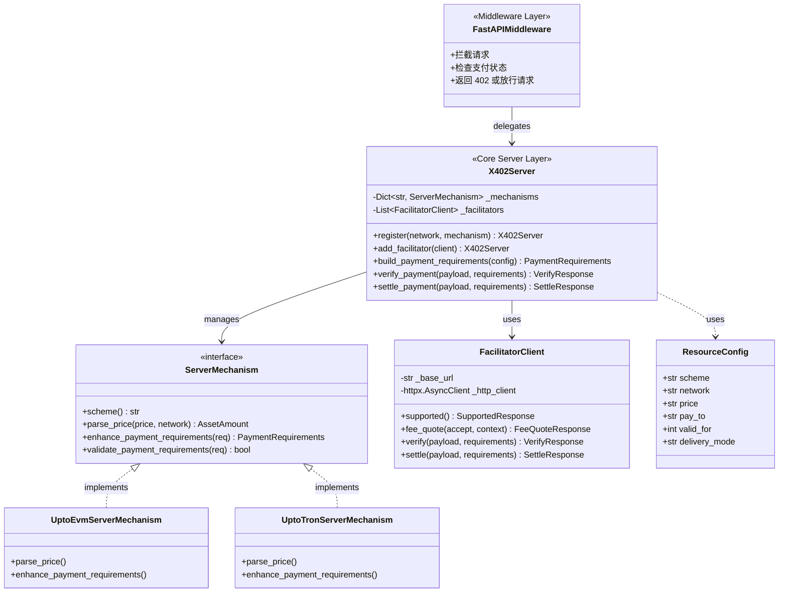
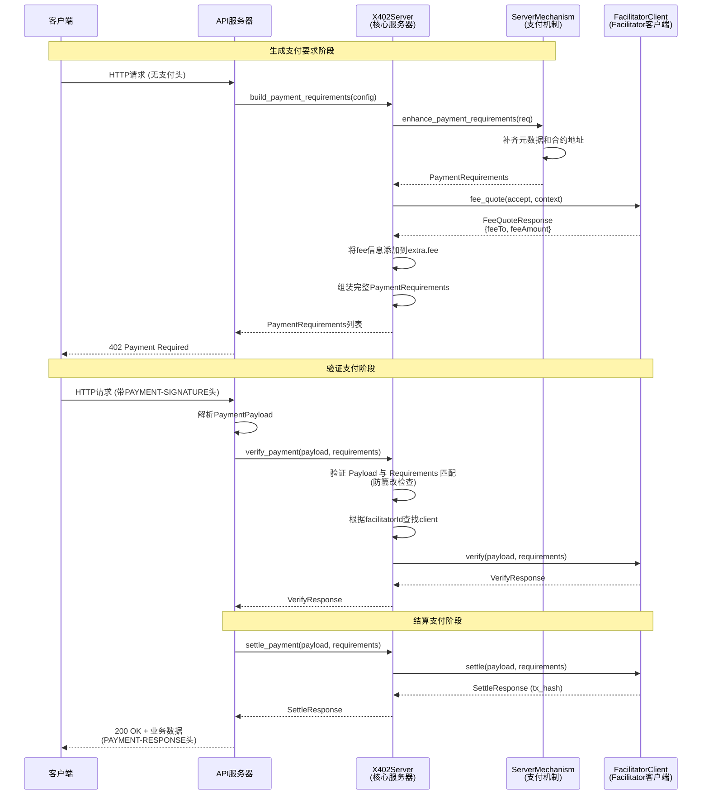

# Server SDK 详细文档

## 概述

Server SDK 提供了完整的支付服务器端功能，支持多链资源计费、402 响应生成、支付验证与结算等。

**核心能力：**
- 为路由/资源定义价格、token、收款地址等支付配置
- 生成标准 402 响应（含多个 accepts 支持不同链）
- 管理 facilitator 客户端，自动路由验证和结算请求
- 支持多链（EVM、TRON、Solana）

---

## Server SDK 使用示例

### 基础使用流程

```python
from fastapi import FastAPI, Request
from tron_x402.server import X402Server, ResourceConfig
from tron_x402.facilitator import FacilitatorClient
from tron_x402.mechanisms.evm import UptoEvmServerMechanism
from tron_x402.mechanisms.tron import UptoTronServerMechanism

app = FastAPI()

# 1. 创建 Server 实例，注册 facilitators
server = (
    X402Server()
    .add_facilitator(FacilitatorClient("https://facilitator1.example.com"))
    .add_facilitator(FacilitatorClient("https://facilitator2.example.com"))
)

# 2. 注册多网络的支付方案
server.register("eip155:8453", UptoEvmServerMechanism())  # Base Mainnet
server.register("tron:mainnet", UptoTronServerMechanism())  # TRON Mainnet

# 3. 在路由中使用
@app.get("/protected-endpoint")
async def protected_endpoint(request: Request):
    # 生成支付要求
    config = ResourceConfig(
        scheme="upto",
        network="eip155:8453",
        price="100 USDC",
        pay_to="0x1234567890123456789012345678901234567890",
    )
    
    requirements = await server.build_payment_requirements(config)
    
    # 解析客户端的支付信息
    payment_payload = parse_payment_payload(request.headers.get("PAYMENT-SIGNATURE"))
    if not payment_payload:
        # 返回 402 要求支付
        payment_required = server.create_payment_required_response(
            requirements=[requirements],
            resource_info={"url": str(request.url)},
        )
        return JSONResponse(payment_required.to_dict(), status_code=402)
    
    # 验证支付（自动调用对应的 facilitator）
    verify_response = await server.verify_payment(payment_payload, requirements)
    if not verify_response.success:
        return JSONResponse({"error": "Payment verification failed"}, status_code=402)
    
    # 结算支付（自动调用对应的 facilitator）
    settle_response = await server.settle_payment(payment_payload, requirements)
    if not settle_response.success:
        return JSONResponse({"error": "Settlement failed"}, status_code=402)
    
    # 返回成功响应
    response = JSONResponse({"data": "..."}, status_code=200)
    response.headers["PAYMENT-RESPONSE"] = base64.b64encode(
        settle_response.to_json().encode("utf-8")
    ).decode("utf-8")
    
    return response
```

---

## 概念模型

### X402Server - 核心支付服务器

**职责：** 管理支付方案和 facilitator，协调支付流程。

**核心能力：**
- **Facilitator 管理**：`add_facilitator(client)` 添加 facilitator 客户端
- **机制注册**：`register(network, mechanism)` 注册支付方案到指定网络
- **支付要求生成**：`build_payment_requirements(config)` 根据资源配置生成支付要求
- **支付验证**：`verify_payment(payload, requirements)` 验证支付签名和有效性
- **支付结算**：`settle_payment(payload, requirements)` 执行链上交易结算

### ServerMechanism - 服务器支付机制

**职责：** 实现特定支付方案（如 upto）在特定链上的服务器端逻辑。

**核心能力：**
- **价格解析**：将人类可读的价格字符串（如 "100 USDC"）转换为链上可用的最小单位
- **元数据补齐**：查询 token 合约获取 symbol、decimals、name 等元数据
- **支付要求增强**：构造完整的 PaymentRequirements，包含所有必要信息

**实现：** `UptoEvmServerMechanism`、`UptoTronServerMechanism`、`UptoSolanaServerMechanism`

**位置：** 作为基础组件，位于 `x402/mechanisms/server/` 目录，可被多个 SDK 共享

### FacilitatorClient - Facilitator 客户端

**职责：** 与 facilitator 服务通信。

**核心能力：**
- 查询 Facilitator 支持的能力
- 查询手续费报价
- 验证支付签名（不发交易）
- 执行支付结算（发送链上交易）

---



## 核心类接口定义

### X402Server - 核心支付服务器

```python
from typing import Dict, List, Optional
from abc import ABC, abstractmethod

class X402Server:
    """
    核心支付服务器，管理支付方案和 facilitator，协调支付流程
    
    职责：
    - 管理多个区块链网络的支付机制
    - 管理 facilitator 客户端
    - 生成支付要求（PaymentRequirements）
    - 验证和结算支付
    """
    
    def __init__(self):
        """初始化服务器，创建空的机制注册表和 facilitator 列表"""
        self._mechanisms: Dict[str, ServerMechanism] = {}
        self._facilitators: List[FacilitatorClient] = []
    
    def register(self, network: str, mechanism: 'ServerMechanism') -> 'X402Server':
        """
        注册支付机制到指定网络
        
        Args:
            network: 网络标识（如 "eip155:8453", "tron:mainnet"）
            mechanism: 支付机制实现（ServerMechanism 实例）
        
        Returns:
            self: 支持链式调用
        
        Example:
            server = X402Server()
            server.register("eip155:8453", UptoEvmServerMechanism())
            server.register("tron:mainnet", UptoTronServerMechanism())
        """
        pass
    
    def add_facilitator(self, client: 'FacilitatorClient') -> 'X402Server':
        """
        添加 facilitator 客户端
        
        Args:
            client: FacilitatorClient 实例
        
        Returns:
            self: 支持链式调用
        """
        pass
    
    async def build_payment_requirements(
        self,
        config: 'ResourceConfig'
    ) -> 'PaymentRequirements':
        """
        根据资源配置生成支付要求
        
        Args:
            config: 资源配置（包含 scheme、network、price、pay_to 等）
        
        Returns:
            PaymentRequirements: 支付要求对象
        
        流程：
            1. 根据 network 查找对应的 mechanism
            2. 调用 mechanism.parse_price() 解析价格
            3. 调用 mechanism.enhance_payment_requirements() 增强支付要求
            4. 查询 facilitator 手续费并添加到 extra.fee
        """
        pass
    
    async def verify_payment(
        self,
        payload: 'PaymentPayload',
        requirements: 'PaymentRequirements'
    ) -> 'VerifyResponse':
        """
        验证支付签名和有效性
        
        Args:
            payload: 客户端提交的支付负载
            requirements: 服务器生成的原始支付要求（用于完整性校验）
        
        Returns:
            VerifyResponse: 验证结果
        
        流程：
            1. **完整性校验**：验证 payload.permit 中的金额、Token、收款人等是否与 requirements 一致，防止客户端篡改支付要求
            2. 从 payload 中提取 facilitatorId
            3. 查找对应的 facilitator client
            4. 调用 facilitator.verify() 验证签名
        """
        pass
    
    async def settle_payment(
        self,
        payload: 'PaymentPayload',
        requirements: 'PaymentRequirements'
    ) -> 'SettleResponse':
        """
        执行支付结算（链上交易）
        
        Args:
            payload: 客户端提交的支付负载
            requirements: 服务器生成的支付要求
        
        Returns:
            SettleResponse: 结算结果（包含 tx_hash）
        
        流程：
            1. 从 payload 中提取 facilitatorId
            2. 查找对应的 facilitator client
            3. 调用 facilitator.settle() 执行结算
        """
        pass
```

### ResourceConfig - 资源配置

```python
from typing import Optional
from dataclasses import dataclass

@dataclass
class ResourceConfig:
    """
    资源支付配置
    
    定义单个资源的支付要求，包括价格、网络、收款地址等
    """
    
    scheme: str
    """支付方案名称（如 "upto", "exact"）"""
    
    network: str
    """网络标识（如 "eip155:8453", "tron:mainnet"）"""
    
    price: str
    """价格字符串（如 "100 USDC", "0.01 ETH"）"""
    
    pay_to: str
    """收款地址"""
    
    valid_for: Optional[int] = 3600
    """支付有效期（秒），默认 1 小时"""
    
    delivery_mode: Optional[str] = "PAYMENT_ONLY"
    """交付模式：PAYMENT_ONLY（链下交付）或 PAYMENT_AND_DELIVERY（链上交付）"""
```

### FacilitatorClient - Facilitator 客户端

```python
import httpx
from typing import Optional

class FacilitatorClient:
    """
    Facilitator 客户端，与 facilitator 服务通信
    
    职责：
    - 查询 facilitator 支持的能力
    - 查询手续费报价
    - 验证支付签名
    - 执行支付结算
    """
    
    def __init__(
        self,
        base_url: str,
        headers: Optional[Dict] = None
    ):
        """
        初始化 Facilitator 客户端
        
        Args:
            base_url: Facilitator 服务的基础 URL
            headers: 自定义 HTTP 头（如 Authorization）
        """
        self._base_url = base_url
        self._headers = headers or {}
        self._http_client = httpx.AsyncClient()
    
    async def supported(self) -> 'SupportedResponse':
        """
        查询 facilitator 支持的能力
        
        Returns:
            SupportedResponse: 包含支持的 network/scheme 组合列表
        
        Example:
            response = await client.supported()
            # response.kinds = [
            #   {"x402Version": 2, "scheme": "upto", "network": "eip155:8453"},
            #   {"x402Version": 2, "scheme": "upto", "network": "tron:mainnet"},
            # ]
        """
        pass
    
    async def fee_quote(
        self,
        accept: 'PaymentRequirements',
        context: Optional[Dict] = None
    ) -> 'FeeQuoteResponse':
        """
        查询手续费报价
        
        Args:
            accept: 支付要求
            context: 支付上下文（如 paymentPermitContext）
        
        Returns:
            FeeQuoteResponse: 手续费报价
        """
        pass
    
    async def verify(
        self,
        payload: 'PaymentPayload',
        requirements: 'PaymentRequirements'
    ) -> 'VerifyResponse':
        """
        验证支付签名（不发交易）
        
        Args:
            payload: 支付负载
            requirements: 支付要求
        
        Returns:
            VerifyResponse: 验证结果
        """
        pass
    
    async def settle(
        self,
        payload: 'PaymentPayload',
        requirements: 'PaymentRequirements'
    ) -> 'SettleResponse':
        """
        执行支付结算（发送链上交易）
        
        Args:
            payload: 支付负载
            requirements: 支付要求
        
        Returns:
            SettleResponse: 结算结果（包含 tx_hash）
        """
        pass
```

### ServerMechanism - 支付机制接口

```python
from abc import ABC, abstractmethod
from typing import Dict, Optional

class ServerMechanism(ABC):
    """
    服务器端支付机制接口
    
    职责：
    - 解析价格字符串为 AssetAmount
    - 生成和增强 PaymentRequirements
    - 验证支付要求的有效性
    """
    
    @abstractmethod
    def scheme(self) -> str:
        """
        返回支付方案名称
        
        Returns:
            方案名称，如 "upto", "exact"
        """
        pass
    
    @abstractmethod
    def parse_price(
        self,
        price: str,
        network: str
    ) -> 'AssetAmount':
        """
        解析价格字符串为 AssetAmount
        
        Args:
            price: 价格字符串（如 "100 USDC", "0.01 ETH"）
            network: 网络标识
        
        Returns:
            AssetAmount: 包含金额、token 地址、decimals 等信息
        
        示例：
            "100 USDC" on eip155:8453 -> 
            AssetAmount(
                amount=100000000,  # 100 * 10^6
                asset="0x833589fCD6eDb6E08f4c7C32D4f71b54bdA02913",
                decimals=6
            )
        """
        pass
    
    @abstractmethod
    def enhance_payment_requirements(
        self,
        requirements: 'PaymentRequirements',
        kind: str
    ) -> 'PaymentRequirements':
        """
        增强支付要求，补齐元数据
        
        Args:
            requirements: 基础支付要求
            kind: 交付模式（"PAYMENT_ONLY" 或 "PAYMENT_AND_DELIVERY"）
        
        Returns:
            PaymentRequirements: 增强后的支付要求
        
        增强内容：
            - 补齐 token 元数据（symbol、decimals、name）
            - 转换金额单位（从人类可读到最小单位）
            - 添加合约地址（payment_permit、merchant）
            - 验证网络、地址、金额有效性
        """
        pass
    
    @abstractmethod
    def validate_payment_requirements(
        self,
        requirements: 'PaymentRequirements'
    ) -> bool:
        """
        验证支付要求的有效性
        
        Args:
            requirements: 支付要求
        
        Returns:
            是否有效
        
        验证项：
            - 网络标识格式正确
            - 地址格式正确
            - 金额大于 0
            - token 地址有效
        """
        pass
```

---

## 核心功能时序图

### 核心支付流程时序图



### 关键流程说明

#### 1. **生成支付要求阶段**
- **构建要求**：`X402Server` 接收资源配置并启动构建流程。
- **增强要求**：`ServerMechanism` 负责补齐 token 元数据（如 symbol, decimals）及相关合约地址。
- **信息注入**：`X402Server` 注入预先获取或缓存的手续费（Fee）信息。
- **返回402**：服务器向客户端返回 `402 Payment Required`，其中包含结构化的支付要求。

#### 2. **验证支付阶段**
- **解析负载**：服务器从 `PAYMENT-SIGNATURE` 请求头中解析出 `PaymentPayload`。
- **验证调用**：`X402Server` 根据负载中的 `facilitatorId` 路由到对应的 `FacilitatorClient` 执行验证逻辑（包括签名和参数合法性）。

#### 3. **结算支付阶段**
- **执行结算**：验证通过后，服务器调用 `X402Server.settle_payment()`。
- **链上操作**：`FacilitatorClient` 负责与促进者服务交互完成链上结算并返回交易哈希。
- **完成响应**：服务器将 `tx_hash` 放入 `PAYMENT-RESPONSE` 响应头，并返回业务数据。

---
