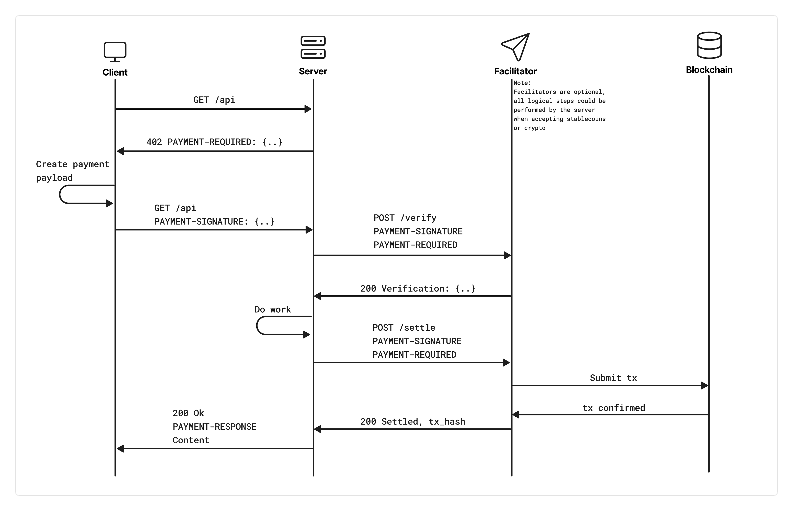
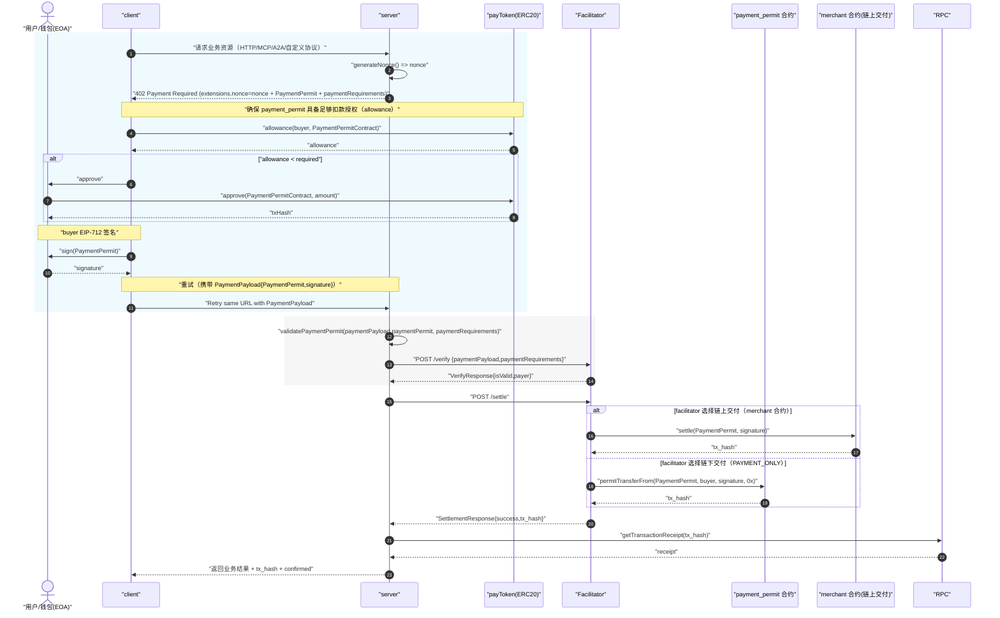
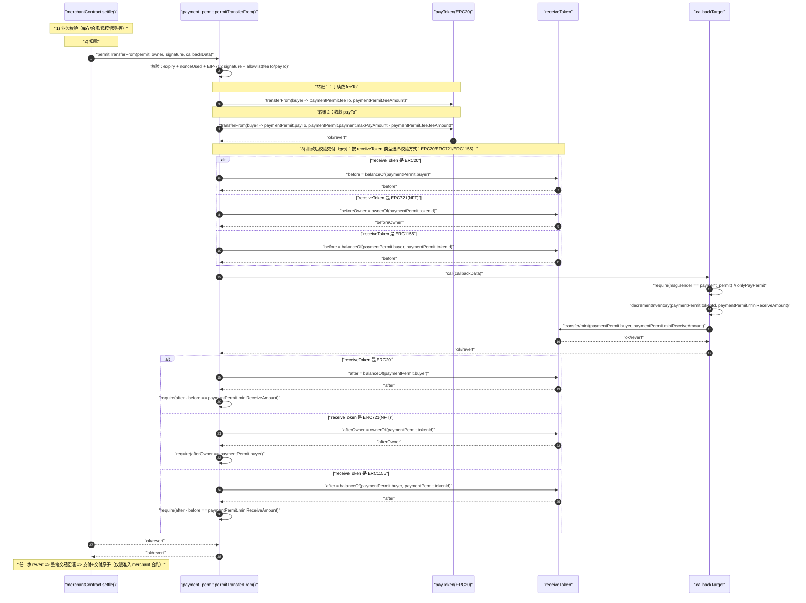

# 项目背景

x402 的目标是减少“按请求付费”的复杂性，让付费访问直接融入 HTTP 调用链路。传统支付依赖账号/订阅/充值、API key 管理与中心化对账，不适合微支付和自动化调用。

x402 把支付嵌入 HTTP：未带有效支付时，server 返回 `402 Payment Required`；client 按要求完成支付并重试同一请求。

本项目把这套流程落在 Tron：以 `ERC-20`（如 USDT）作为支付媒介，把收款与交付/授权放进链上结算；覆盖付费 API、Pay-then-Deliver、RWA 购买交付等场景。


# 业界方案调研
参考资料：<https://x402.gitbook.io/x402>

### x402（以太坊）

- **适用场景**
  - API 按次/按量计费
  - 微支付
  - Agent 自动付费

- **支付流程（概览）**
  - `GET` → `402`（给出支付要求）→ client 签名后重试 → server 调 facilitator `verify/settle` → `200`

- **Token / 网络 / gas 要点**
  - EVM 侧常用 EIP-3009（`transferWithAuthorization`）：用户离线签名授权，facilitator 代付 gas，实现“一步扣款”。
  - facilitator 通常按“网络能力”支持支付：在其支持的网络上，满足标准的 token 就能用。
  - EVM：实现 EIP-3009 的 ERC-20
  - Solana：SPL / Token-2022
  - Tron：如需支持类似能力，可通过发行兼容的新 token




# 支持的业务场景


- **交付模式**
  - 链上支付 + 链下交付
  - 链上支付 + 链上交付

- **支付币种**
  - 普通 ERC-20（如 USDT）
  - 支持 EIP-3009 的 token

- **交付资产类型**
  - ERC-721（NFT/凭证）
  - ERC-20（份额/代币）
  - ERC-1155（票据/权益）

- **取消/幂等**
  - 支持按订单号/nonce 做幂等与取消，避免重复扣款或重复交付


# 设计目标


# 核心概念解释

 - **payment_permit**
   - 平台的支付结算能力：负责“收钱 + 对账/防重复”。
   - 可按业务需要选择仅支付，或支付同时触发链上交付。

 - **facilitator**
   - 平台的“上链执行方”：负责把 server 的结算请求发到链上（作为交易发起方/tx sender），并代付 gas。
   - 对外提供 `verify/settle` 能力，返回交易 hash 供业务侧确认结果。

 - **merchant 合约**
   - 业务侧的“卖方/商品”合约：定义卖什么、卖给谁、怎么交付。
   - 需要链上交付时，负责在链上把资产/凭证发给用户。

 - **PAYMENT_ONLY**
   - 交付类型。链上完成支付；交付在链下完成。

 - **PAYMENT_AND_DELIVERY**
   - 交付类型。链上同时完成支付与交付；要么都成功，要么都失败。

# 设计思路及折中

- **以太坊 x402 协议兼容**
  - 保持 `402 → 重试 → verify/settle → 200` 的调用链路。
  - x402 原字段不动；Tron 差异通过扩展字段承载。

- **上链费用（gas）支付思路**
  - 由发起链上交易的一方付 gas；工程上通常由 `Facilitator` 统一代付。
  - `Facilitator` 的 gas 成本通过手续费回收：在结算交易中从 buyer 转账 `feeAmount` 到 `feeTo`（facilitator 收款地址）。

- **交付模式（delivery）**
  - **链上结算 + 链上交付**：同交易完成，失败则回滚。
  - **链上结算 + 链下交付**：交付由链下系统兜底，需要做对账与重试。

# 核心流程

主流程：

1. client 请求业务接口，server 返回 `402`（包含 `PaymentPermit` + `nonce`）。
2. client 检查并补齐授权（必要时先 `approve`）。
3. client 对 `PaymentPermit` 签名，并携带签名重试同一请求。
4. server 先调用 facilitator `/verify` 做快速校验。
5. server 调用 facilitator `/settle` 发起链上交易（facilitator 代付 gas）。
6. 链上结算由 `payment_permit.permitTransferFrom(...)` 完成扣款。
7. 交付：链上交付走 merchant 合约；链下交付由 server 链下完成（都以 `nonce` 做幂等）。
8. server 获取交易回执并返回 `200`（包含 `tx_hash`）。


### PaymentPermit 数据结构

把 `PaymentPermit` 拆成 5 组字段，便于维护与按场景填写：

- **Meta（幂等/时效/模式）**：`kind`、`paymentId`、`nonce`、`validAfter`、`validBefore`
- **Payer（签名者）**：`buyer`
- **Payment（扣款/收款）**：`payToken`、`maxPayAmount`、`payTo`
- **Fee（手续费，可选）**：`feeTo`、`feeAmount`
- **Delivery（交付期望，仅链上交付时需要）**：`receiveToken`、`miniReceiveAmount`、`tokenId`


| 字段 | 含义 | 什么时候用 | 怎么设值 |
| --- | --- | --- | --- |
| `kind` | 交付类型 | 必填 | `PAYMENT_ONLY` 或 `PAYMENT_AND_DELIVERY` |
| `paymentId` | 订单号 | 必填 | 业务订单号/UUID（用于对账） |
| `nonce` | 幂等号 | 必填 | server 生成（同一订单/请求保持不变） |
| `validAfter` | 生效时间 | 必填 | server 设定（Unix 秒；早于该时间则拒绝） |
| `validBefore` | 失效时间 | 必填 | server 设定（Unix 秒；晚于该时间则拒绝） |
| `buyer` | 付款方 | 必填 | 发起支付的用户地址 |
| `payToken` | 支付币种 | 必填 | 例如 USDT 合约地址 |
| `maxPayAmount` | 最大可扣款 | 必填 | 本单最大扣款上限（防止多扣） |
| `payTo` | 主收款方 | 必填 | 业务收款地址 |
| `feeTo` | 手续费收款方 | 可选 | 不收手续费则置 `0x0` |
| `feeAmount` | 手续费金额 | 可选 | 不收手续费则置 `0` |
| `receiveToken` | 交付资产 | 仅链上交付 | 交付资产合约地址 |
| `miniReceiveAmount` | 最小交付数量 | 仅链上交付 | ERC20/ERC1155 数量下限（ERC721 通常为 `1`） |
| `tokenId` | 交付标识 | 仅链上交付 | ERC721/ERC1155 的 `tokenId`（ERC20 可为 `0`） |


```solidity
struct PaymentPermit {
  PermitMeta meta;   // 订单与时效信息
  address buyer;     // 付款方（签名者）
  address caller;    // 限定谁调用 permitTransferFrom（验证 msg.sender）
  Payment payment;   // 支付币种与收款信息
  Fee fee;           // 手续费（可为 0）
  Delivery delivery; // 交付期望（链上交付时使用）
}

struct PermitMeta {
  uint8 kind;        // PAYMENT_ONLY / PAYMENT_AND_DELIVERY
  bytes16 paymentId; // 业务侧订单号（用于对账/追踪）
  uint256 nonce;     // 幂等键（按 owner 地址隔离）
  uint256 validAfter;  // 生效时间
  uint256 validBefore; // 失效时间
}

struct Payment {
  address payToken;      // 支付 token
  uint256 maxPayAmount;  // 本次最大可扣款额度
  address payTo;         // 主收款地址
}

struct Fee {
  address feeTo;     // 手续费收款地址
  uint256 feeAmount; // 手续费金额（可为 0）
}

struct Delivery {
  address receiveToken;   // 交付资产合约
  uint256 miniReceiveAmount;  // 最小交付数量（ERC20/ERC1155）
  uint256 tokenId;        // 交付 tokenId（ERC721/ERC1155；ERC20 可为 0）
}

bytes signature; // buyer 的签名

```



# payment_permit合约

对外语义：提供“离线授权 + 上链扣款”的统一入口 `permitTransferFrom(...)`，并通过 `callbackTarget/callbackHash/callbackData` 可选支持链上交付回调。
payment_permit 需要同时支持两类交付模式（`PAYMENT_AND_DELIVERY` / `PAYMENT_ONLY`）。

从调用路径看：

- **链上交付（PAYMENT_AND_DELIVERY）**：由 facilitator 调用 merchant 合约，merchant 合约在 `settle(...)` 内再调用 payment_permit。
- **链下交付（PAYMENT_ONLY）**：由 facilitator（或 server 自实现）直接调用 payment_permit。

当前实现以 **单一入口函数**承载两类模式：

- `permitTransferFrom(...)`：用于结算扣款；`callbackTarget/callbackHash/callbackData` 为可选参数。
  - 需要链上交付回调时：传入有效的 `callbackTarget` 与 `callbackData`，并传入与之匹配的 `callbackHash`。
  - 不需要回调（例如 `PAYMENT_ONLY`）时：使用零值约定：`callbackTarget = address(0)`、`callbackHash = bytes32(0)`、`callbackData = 0x`。


接口定义：

```solidity
interface IPaymentPermit {
  function permitTransferFrom(
    PaymentPermit calldata permit,
    address owner,
    bytes calldata signature,
    address callbackTarget,
    bytes32 callbackHash,
    bytes calldata callbackData
  ) external;

  function nonceUsed(address owner, uint256 nonce) external view returns (bool);

  function cancelNonce(uint256 nonce) external;
}
```

输入：

- **`permit`**：与前文一致（原 `PaymentPermit`）。
- **`owner`**：签名者地址，必须与 `permit.buyer` 一致。
- **`signature`**：buyer 对 `PaymentPermit` 的 EIP-712 签名（65 bytes）。
- **`callbackTarget/callbackHash/callbackData`**：
  - **PAYMENT_AND_DELIVERY**：用于链上交付回调。
    - `callbackTarget`：接收回调的合约（典型为 merchant 或其回调适配器）。
    - `callbackData`：回调 calldata。
    - `callbackHash`：与 `callbackData` 匹配的 hash，用于防止篡改。
  - **PAYMENT_ONLY**：使用零值约定：
    - `callbackTarget = address(0)`
    - `callbackHash = bytes32(0)`
    - `callbackData = 0x`

输出：

- **`permitTransferFrom(...)`**：无返回值；成功则交易执行完成，失败则 `revert` 并回滚所有状态变更。
- **`nonceUsed(owner, nonce)`**：返回 `true/false`。
- **`cancelNonce(nonce)`**：无返回值；用于 buyer 主动取消某个 `nonce`（后续同 `buyer+nonce` 的授权将不可再用）。


# Merchant 合约
对外语义：当 `PaymentPermit.meta.kind = PAYMENT_AND_DELIVERY` 时，facilitator 选择链上交付路径，直接发起交易调用 Merchant 的 `settle(...)`；Merchant 在同一笔交易内完成“业务校验 + 调用 payment_permit 扣款 + 链上交付”。


```solidity
interface IMerchant {
  // 对外购买入口：Facilitator 直接调用该函数上链
  function settle(PaymentPermit calldata paymentPermit, bytes calldata signature) external;
  function settle(PaymentPermit calldata paymentPermit, bytes calldata merchantData, bytes calldata signature, bytes calldata merchantSignature) external;
}
```


输入：

- **`paymentPermit`**：与前文 `PaymentPermit` 结构一致。
  - **幂等**：`paymentPermit.meta.nonce` 作为幂等键（按 `buyer` 维度隔离）。
  - **交付**：当走链上交付时，应填写 `paymentPermit.delivery.*`（交付资产/数量/tokenId）。
- **`signature`**：buyer 对 `PaymentPermit` 的 EIP-712 签名（65 bytes）。

输出：

- **链上返回值**：无（Solidity `external` 无 return）。
- **交易层输出**：成功时由链返回 `tx_hash`（facilitator 将其返回给 server）。
- **失败语义**：任一步 `revert` 则整笔交易回滚（支付与交付原子）。

# merchant 与 payment_permit 合约时序



# 核心模块设计

## Server接口

server 与 client 的传输协议遵循 x402 的三段式语义：

- `PaymentRequired`：服务端声明“需要支付”并给出支付要求
- `PaymentPayload`：客户端携带支付授权重试请求
- `SettlementResponse`：服务端返回结算结果（含 `tx_hash`）

### Transport 无关约定（HTTP / MCP / A2A / 自定义协议）

三类消息的数据结构保持一致，差异仅在“承载位置/状态码映射”：

- **HTTP**：`402(PaymentRequired)` → 重试携带 `PaymentPayload` → `200(SettlementResponse)`
- **MCP**：tool/resource 返回“payment required”并携带 `PaymentRequired` → 下一次 tool 调用携带 `PaymentPayload` → 成功返回携带 `SettlementResponse`
- **A2A**：agent 返回“payment required”并携带 `PaymentRequired` → 下一条消息携带 `PaymentPayload` → 成功响应携带 `SettlementResponse`
- **自定义协议**：任何请求-响应模型均可按 `REQUIRED → RETRY_WITH_PAYMENT → SUCCESS/FAIL` 对接

#### HTTP Headers（X402 v2 标准）

| 场景 | Header 名称 | 值 | 说明 |
|------|-----------|-----|------|
| 客户端提交支付（request） | `PAYMENT-SIGNATURE` | `<encoded payment payload>` | base64 编码的 `PaymentPayload`（包含 permit、signature 等） |
| 服务端发起 402 challenge（response） | `PAYMENT-REQUIRED` | `<encoded PaymentRequired>` | base64 编码的 `PaymentRequired`（包含 accepts、extensions 等）；header 承载，不在 body |
| 服务端返回结算结果（response） | `PAYMENT-RESPONSE` | `<encoded SettlementResponse>` | base64 编码的 `SettlementResponse`（包含 tx_hash、success 等） |

### 核心字段（Tron 版扩展）

- `PaymentRequired.accepts[0]`：计价口径（`scheme/network/amount/asset/payTo/...`）
- `PaymentPermit` 由 client 基于 `accepts[0]` 构造，尽量复用并保持一致：
  - `payment.payToken` = `accepts[0].asset`
  - `payment.payTo` = `accepts[0].payTo`
  - `payment.maxPayAmount` = `accepts[0].amount`
- `PaymentRequired.accepts[i].extra`：承载该支付选项专属信息（例如 token `name/version`、以及该选项对应的 `fee`）
- `PaymentRequired.extensions`：承载多选项共用字段（例如 `nonce`、`paymentPermitContext(meta/delivery)`）
- `PaymentPayload.payload`：`{ paymentPermit, signature, merchantSignature }`（其中 `paymentPermit.payment.*` 必须与 `accepts[0]` 一致；`merchantSignature` 由 server 侧生成并透传给 merchant 合约）

示例：Tron 扩展版 `PaymentRequired`（保留 x402 v2 标准字段，并通过 `extensions` 承载上链所需的 `paymentPermit`）：

```json
{
  "x402Version": 2,
  "error": "PAYMENT-SIGNATURE is required",
  "resource": {
    "url": "https://api.example.com/premium-data",
    "description": "Access to premium market data",
    "mimeType": "application/json"
  },
  "accepts": [
    {
      "scheme": "exact",
      "network": "tron:shasta",
      "amount": "50000000",
      "asset": "TXXXXXXXXXXXXXXXXXXXXXXXXXXXXXXX",
      "payTo": "TYYYYYYYYYYYYYYYYYYYYYYYYYYYYYYY",
      "maxTimeoutSeconds": 60,
      "extra": {
        "name": "USDT",
        "version": "1",
        "fee": {
          "facilitatorId": "facilitator_1",
          "feeTo": "TFFFFFFFFFFFFFFFFFFFFFFFFFFFFFFF",
          "feeAmount": "1000000"
        }
      }
    }
  ],
  "extensions": {
    "paymentPermitContext": {
      "meta": {
        "kind": "PAYMENT_ONLY",
        "paymentId": "order_20251218_0001",
        "nonce": "123456789",
        "expiry": 1734512345
      },
      "delivery": {
        "receiveToken": "T0000000000000000000000000000000",
        "miniReceiveAmount": "0",
        "tokenId": "0"
      }
    }
  }
}
```

client 基于 `accepts[0] + accepts[0].extra.fee + buyerAddress + extensions.paymentPermitContext` 组装完整 `PaymentPermit`，并签名得到 `signature`。

server 在调用 facilitator `/verify` 前必须先做：

- `validatePaymentPermit(paymentPayload.paymentPermit, paymentRequirements)`


## Client签名流程

client 从 `PaymentRequired` 中选择一个 `accepts[i]`，并把 `accepts[i] + accepts[i].extra.fee + buyerAddress + extensions.paymentPermitContext` 合并为最终 `PaymentPermit`。

| PaymentPermit 字段 | 来源 | 映射规则 |
| --- | --- | --- |
| `meta.kind` | `extensions.paymentPermitContext.meta.kind` | 直接拷贝 |
| `meta.paymentId` | `extensions.paymentPermitContext.meta.paymentId` | 直接拷贝 |
| `meta.nonce` | `extensions.paymentPermitContext.meta.nonce` | 直接拷贝 |
| `meta.expiry` | `extensions.paymentPermitContext.meta.expiry` | 直接拷贝 |
| `buyer` | client 本地 | `buyer = buyerAddress` |
| `payment.payToken` | `accepts[i].asset` | `payToken = asset` |
| `payment.payTo` | `accepts[i].payTo` | `payTo = payTo` |
| `payment.maxPayAmount` | `accepts[i].amount` | `maxPayAmount = amount` |
| `fee.feeTo` | `accepts[i].extra.fee.feeTo` | 直接拷贝（无手续费可置 `0x0`） |
| `fee.feeAmount` | `accepts[i].extra.fee.feeAmount` | 直接拷贝（无手续费可置 `0`） |
| `delivery.receiveToken` | `extensions.paymentPermitContext.delivery.receiveToken` | 直接拷贝（`PAYMENT_ONLY` 时可为 `0x0`） |
| `delivery.miniReceiveAmount` | `extensions.paymentPermitContext.delivery.miniReceiveAmount` | 直接拷贝（`PAYMENT_ONLY` 时可为 `0`） |
| `delivery.tokenId` | `extensions.paymentPermitContext.delivery.tokenId` | 直接拷贝（`PAYMENT_ONLY` 时可为 `0`） |

 构造完成后，client 对 `PaymentPermit` 做 EIP-712 签名得到 `signature`，并在重试请求中以 x402 标准 `PaymentPayload` 结构回传：

```json
{
  "x402Version": 2,
  "resource": {
    "url": "https://api.example.com/premium-data",
    "description": "Access to premium market data",
    "mimeType": "application/json"
  },
  "accepted": {
    "scheme": "exact",
    "network": "tron:shasta",
    "amount": "50000000",
    "asset": "T...USDT...",
    "payTo": "T...merchant...",
    "extra": {
      "name": "USDT",
      "fee": { "feeTo": "T...facilitatorFeeReceiver...", "feeAmount": "1000000" }
    }
  },
  "payload": {
    "signature": "0x...",
    "merchantSignature": "0x...",
    "paymentPermit": {
      /* PaymentPermit */
    }
  },
  "extensions": {}
}
```

字段说明（PaymentPayload）：

| 字段 | 是否必填 | 说明 |
| --- | --- | --- |
| `x402Version` | 必填 | x402 协议版本号；当前为 `2`。 |
| `resource` | 可选 | 资源描述，用于让 client 理解“正在为哪个资源付费”（不同传输层可用不同方式表达）。 |
| `resource.url` | 可选 | 资源标识 URL。 |
| `resource.description` | 可选 | 资源的业务描述。 |
| `resource.mimeType` | 可选 | 资源返回内容的 MIME 类型。 |
| `accepted` | 必填 | client 选定并接受的支付方案，必须对应 `PaymentRequired.accepts[i]` 中的某一项。 |
| `accepted.scheme` | 必填 | 支付 scheme（例如 `exact`）。 |
| `accepted.network` | 必填 | 网络标识（例如 `tron:shasta`）。 |
| `accepted.asset` | 必填 | 支付 token 地址。 |
| `accepted.payTo` | 必填 | 主收款地址。 |
| `accepted.amount` | 必填 | 主收款金额（最小单位）。 |
| `accepted.extra` | 可选 | scheme/network 的扩展字段；本方案把 `fee` 放在此处。 |
| `accepted.extra.fee` | 可选 | 手续费信息；当 `pricing: "per_accept"` 时，resource server 应把每个 accept 对应的 `feeTo/feeAmount` 报价写入此处。 |
| `payload` | 必填 | 支付授权载荷；不同链/不同 scheme 会定义不同的 payload 形态。 |
| `payload.paymentPermit` | 必填 | Tron 扩展：链上结算所需的 `PaymentPermit`（由 client 根据 `accepted + extensions.paymentPermitContext` 构造）。 |
| `payload.signature` | 必填 | Tron 扩展：buyer 对 `PaymentPermit` 的 EIP-712 签名。 |
| `payload.merchantSignature` | 可选 | Tron 扩展：server 对本次链上交付的签名（仅 `PAYMENT_AND_DELIVERY` 时需要）；server 生成后随 `paymentPayload` 传给 facilitator，由 facilitator 透传给 merchant 合约用于校验/授权。 |
| `extensions` | 可选 | x402 扩展字段容器（例如 `paymentPermitContext` 等）。 |

## Facilitator接口

本节仅定义 **HTTP** 协议下的 facilitator API（参考 x402 facilitator 示例），对外提供：

- `GET /supported`
- `POST /fee/quote`
- `POST /verify`
- `POST /settle`

### GET /supported

返回 facilitator 支持的支付方案集合。

响应：

```json
{
  "kinds": [
    { "x402Version": 2, "scheme": "exact", "network": "tron:shasta" }
  ],
  "fee": {
    "feeTo": "T...facilitatorFeeReceiver...",
    "pricing": "per_accept"
  }
}
```

### POST /fee/quote

语义：查询 facilitator 对某个 `accepts[i]` 的 **手续费报价**，用于 server 计算并填充 `PaymentRequired.accepts[i].extra.fee`。

当 `pricing: "per_accept"` 时，server 应对每个候选 `accepts[i]` 分别调用本接口拿到各自的 `feeAmount`（不同 `asset` 可能得到不同报价）。

请求（以某个 `accepts[i]` 为入参）：

```json
{
  "accept": {
    "scheme": "exact",
    "network": "tron:shasta",
    "asset": "T...USDT...",
    "amount": "50000000",
    "payTo": "T...merchant..."
  },
  "paymentPermitContext": {
    /* PaymentPermitContext，可选：用于更精确估算（例如是否需要链上交付） */
  }
}
```

响应：

```json
{
  "fee": {
    "feeTo": "T...facilitatorFeeReceiver...",
    "feeAmount": "1000000"
  },
  "pricing": "per_accept",
  "network": "tron:shasta",
  "expiresAt": 1730000000
}
```

### POST /verify

语义：校验 `PaymentPayload` 是否可结算（不广播链上交易）。

请求：

```json
{
  "paymentPayload": {
    /* PaymentPayload */
  },
  "paymentRequirements": {
    /* PaymentRequirements = PaymentRequired.accepts[i] */
  }
}
```

响应（成功）：

```json
{
  "isValid": true
}
```

响应（失败）：

```json
{
  "isValid": false,
  "invalidReason": "invalid_signature"
}
```

### POST /settle

语义：执行链上结算并返回交易哈希。

请求：与 `/verify` 完全一致。

响应（成功）：

```json
{
  "success": true,
  "transaction": "0x...tx_hash...",
  "network": "tron:shasta"
}
```

响应（失败）：

```json
{
  "success": false,
  "errorReason": "insufficient_balance",
  "transaction": "",
  "network": "tron:shasta"
}
```

约束：

- **`paymentRequirements`** 必须是 `PaymentRequired.accepts[i]` 原样回传。
- **`paymentPayload.accepted`** 必须与 `paymentRequirements` 对应同一个 `accepts[i]`。


## merchant合约接口示例

输入输出示例（链上交付 / PAYMENT_AND_DELIVERY）：

调用（示例参数，结构化展示）：

```json
{
  "function": "settle",
  "args": {
    "paymentPermit": {
      "meta": {
        "kind": "PAYMENT_AND_DELIVERY",
        "paymentId": "order_20251218_0001",
        "nonce": "123456789",
        "validAfter": 1734512000,
        "validBefore": 1734512600
      },
      "buyer": "TBuyer111111111111111111111111111111",
      "payment": {
        "payToken": "T...USDT...",
        "maxPayAmount": "50000000",
        "payTo": "TMerchant2222222222222222222222222222"
      },
      "fee": {
        "feeTo": "TFacFee33333333333333333333333333333",
        "feeAmount": "1000000"
      },
      "delivery": {
        "receiveToken": "TRWAToken44444444444444444444444444",
        "miniReceiveAmount": "1",
        "tokenId": "10086"
      }
    },
    "signature": "0x..."
  }
}
```

返回（交易成功）：

```json
{
  "success": true,
  "transaction": "0x...tx_hash...",
  "network": "tron:shasta"
}
```

返回（交易失败 / 回滚）：

```json
{
  "success": false,
  "errorReason": "reverted",
  "transaction": "",
  "network": "tron:shasta"
}
```

## payment_permit合约接口示例

```solidity
interface IPaymentPermit {
  function permitTransferFrom(
    PaymentPermit calldata permit,
    address owner,
    bytes calldata signature,
    address callbackTarget,
    bytes32 callbackHash,
    bytes calldata callbackData
  ) external;

  function nonceUsed(address owner, uint256 nonce) external view returns (bool);

  function cancelNonce(uint256 nonce) external;
}
```


输入输出示例 1（链下交付 / PAYMENT_ONLY，零值回调）：

调用：

```json
{
  "function": "permitTransferFrom",
  "args": {
    "permit": {
      "meta": {
        "kind": "PAYMENT_ONLY",
        "paymentId": "order_20251218_0002",
        "nonce": "22334455",
        "validAfter": 1734512000,
        "validBefore": 1734512600
      },
      "buyer": "TBuyer111111111111111111111111111111",
      "payment": {
        "payToken": "T...USDT...",
        "maxPayAmount": "50000000",
        "payTo": "TMerchant2222222222222222222222222222"
      },
      "fee": {
        "feeTo": "TFacFee33333333333333333333333333333",
        "feeAmount": "1000000"
      },
      "delivery": {
        "receiveToken": "T0000000000000000000000000000000",
        "miniReceiveAmount": "0",
        "tokenId": "0"
      }
    },
    "owner": "TBuyer111111111111111111111111111111",
    "signature": "0x...",
    "callbackTarget": "0x0000000000000000000000000000000000000000",
    "callbackHash": "0x0000000000000000000000000000000000000000000000000000000000000000",
    "callbackData": "0x"
  }
}
```

返回（交易成功）：

```json
{
  "success": true,
  "transaction": "0x...tx_hash...",
  "network": "tron:shasta"
}
```

输入输出示例 2（链上交付回调 / PAYMENT_AND_DELIVERY）：

调用（重点展示回调参数）：

```json
{
  "function": "permitTransferFrom",
  "args": {
    "permit": { "meta": { "kind": "PAYMENT_AND_DELIVERY" }, "buyer": "TBuyer...", "payment": { "payToken": "T...USDT...", "maxPayAmount": "50000000", "payTo": "TMerchant..." }, "fee": { "feeTo": "TFacFee...", "feeAmount": "1000000" }, "delivery": { "receiveToken": "TRWAToken...", "miniReceiveAmount": "1", "tokenId": "10086" } },
    "owner": "TBuyer...",
    "signature": "0x...",
    "callbackTarget": "TMerchant5555555555555555555555555555",
    "callbackHash": "0x...hash_of_callbackData...",
    "callbackData": "0x...encoded_delivery_call..."
  }
}
```

返回（交易失败 / 回滚示例）：

```json
{
  "success": false,
  "errorReason": "invalid_signature",
  "transaction": "",
  "network": "tron:shasta"
}
```