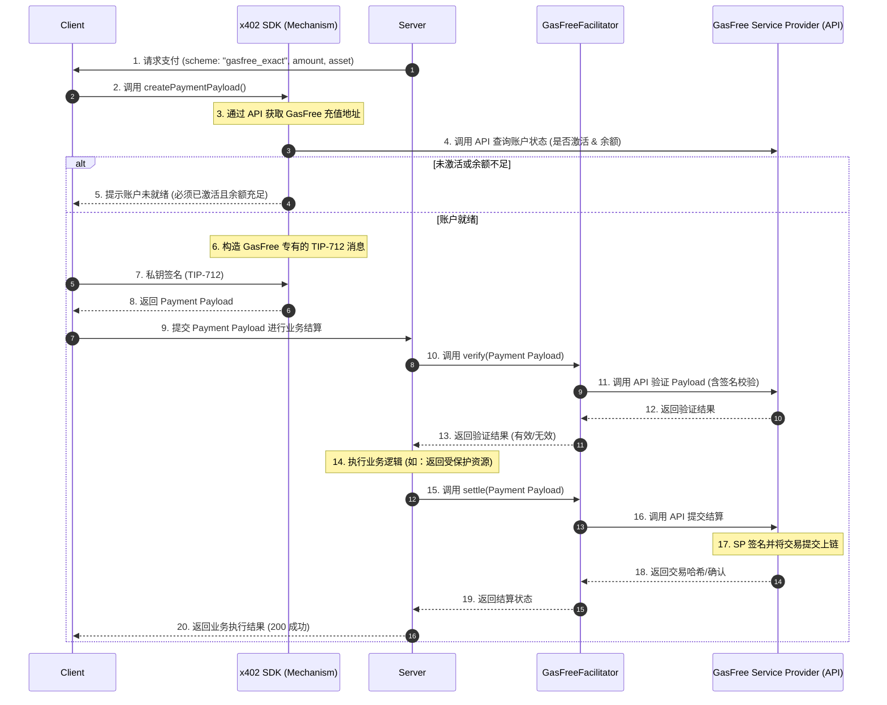

# x402 GasFree 支付方案详细设计文档

## 1. 概述

本设计旨在为 x402 协议扩展对 GasFree 协议的支持。GasFree 是一套成熟的波场（TRON）免 Gas 转账标准，允许 Client 在不持有原生 TRX 的情况下，通过签名授权的方式完成 TRC20 代币转账。

x402 SDK 通过集成 GasFree，使得 Facilitator 可以作为“服务提供商”角色，利用 GasFree 智能合约机制为 Client 提供代付服务，从而降低 Client 的参与门槛。

### 1.1 核心支持范围
- **资产范围**：初期仅支持 **USDT** 和 **USDD**。
- **支付模式**：目前支持 **固定金额 (GasFree Exact)** 支付方案。
- **适用网络**：TRON Mainnet, Nile Testnet, Shasta Testnet。
- **实现策略**：Client 端 (TypeScript) 与 Facilitator 端 (Python) 均**严格依赖** GasFree 官方 SDK 或 HTTP API 完成核心逻辑，**严禁**直接与 `GasFreeController` 智能合约进行交互（如构造 Raw Transaction、调用 ABI 等）。

## 2. 设计目标

- **完全兼容性**：不破坏现有的 `X402Client` 和 `Facilitator` core 抽象框架。
- **零配置接入**：开发者使用 `GasFreeFacilitator` 与使用普通 `X402Facilitator` 方式相同，无需额外复杂配置。
- **抽象层隔离 (Black-Box)**：
    - x402 SDK 将 GasFree 视为黑盒服务。
    - **禁止**在 SDK 中包含合约 ABI、构造合约调用数据或直接管理 GasFree 的链上状态。
    - 所有操作必须通过高层 SDK 方法或 API 端点完成。
- **账户准入控制**：x402 SDK 仅允许**已激活**且**余额充足**的账户发起 GasFree 支付，从而确保支付流程的高成功率。


## 3. 业务流程与架构

### 3.1 业务时序图



### 3.2 字段语义映射方案

为了保持 `PaymentPayload` 数据结构的稳定性，我们采用“寄生映射”策略：

| GasFree 标准字段 | x402 `PaymentPermit` 映射字段 | 逻辑含义说明 |
| :--- | :--- | :--- |
| `token` | `payment.payToken` | 待转账代币地址 (USDT/USDD) |
| `user` | `buyer` | Client 钱包地址 (签名者) |
| `receiver` | `payment.payTo` | 接收者地址 |
| `value` | `payment.payAmount` | 支付金额 (原始单位) |
| `maxFee` | `fee.feeAmount` | GasFree 机制允许的最大手续费 |
| `serviceProvider`| `fee.feeTo` | Facilitator 接收地址 |
| `deadline` | `meta.validBefore` | 授权截止时间 (Unix 时间戳) |
| `nonce` | `meta.nonce` | GasFree 系统内部流水号 |
| `version` | (SDK 内部硬编码: 1) | 协议版本 |

### 3.3 账户准备与状态检查

GasFree 钱包地址是一个计算出的虚拟地址（Counterfactual Address）。为了提供无缝的 x402 支付体验，SDK 实施了严格的准入要求：

1. **地址获取**：SDK **必须**调用 GasFree 官方 SDK（TS）或 HTTP API（Python）来获取 `gasfreeAddress`，禁止本地实现推导算法。
2. **强制激活**：
    - x402 SDK 仅允许从**已激活**的 GasFree 账户进行支付。
    - **原因**：虽然 GasFree 支持 Counterfactual 部署（首笔交易自动部署），但这会产生额外的 Gas 费用，可能导致 `maxFee` 估算不足或交易失败。为简化初期集成的费率模型，我们要求账户预先激活（Deployed）。
    - 如果账户尚未激活，SDK 将拒绝支付请求，并引导用户先激活其 GasFree 钱包。
3. **余额验证**：
    - SDK 验证 `gasfreeAddress` 中的余额是否大于等于 `支付金额 + 最大手续费`。
    - 只有余额充足的账户才能继续进行支付授权签名。
4. **API 集成**：所有的状态检查（激活状态、余额、Nonce）均通过 GasFree HTTP API 或官方 SDK 完成，以确保准确性并降低链上查询的复杂性。

## 4. 技术实现细节

### 4.1 GasFree 配置管理
SDK 内部维护 GasFree 服务的基础配置（如 API Endpoint URL），用于初始化 SDK 或 API 客户端。
**注意**：合约地址等链上参数应由底层的 GasFree SDK/API 管理，x402 SDK 不应硬编码或直接使用这些地址进行链上交互。

### 4.2 地址计算与状态查询
x402 SDK 采用统一策略：
- **TS SDK**：直接调用 `@gasfree/gasfree-sdk` 的 `generateGasFreeAddress` 方法。
- **Python SDK**：调用 GasFree HTTP API 的 `/address` 端点获取地址，严禁本地实现算法。

### 4.3 客户端机制 (Client Mechanism)
- **SDK/API 集成**：优先调用 GasFree SDK 或 HTTP API 完成业务逻辑。
- **Nonce 管理**：通过 API 获取最新的 `nonce`。
- **方案标识符**：明确为 `gasfree_exact`。

### 4.4 GasFreeFacilitator 与机制实现
- **GasFreeFacilitatorMechanism**：作为协议转换层，将 x402 格式的签名数据转换为 GasFree 格式。
- **GasFreeFacilitator (Python)**：
    - **API 代理模式**：Facilitator 并不直接作为 Relayer 向链上提交交易，而是作为代理，将签名后的 Payload 转发给 GasFree 的 HTTP API (`/submit` 或类似端点)。
    - **职责边界**：GasFree API 负责交易的组装、签名（Relayer 签名）和上链。Facilitator 仅负责业务层的验证和请求转发。
    - **本地验证**：仅做基础格式校验，核心逻辑验证委托给 API。

## 5. 使用便捷性

### 5.1 Client 初始化 (TypeScript)
```typescript
const client = new X402Client()
  .register('tron:gasfree_exact', new GasFreeTronClientMechanism(signer));
```

### 5.2 Facilitator 初始化 (Python)
`GasFreeFacilitator` 被设计为处理 GasFree 结算的直接实现。其用法与标准的 `X402Facilitator` 完全一致：

```python
# GasFreeFacilitator 自动处理 GasFree 机制的注册
facilitator = GasFreeFacilitator(
    networks=["tron:mainnet", "tron:nile"], 
    signer=signer
)
```

## 6. 安全性分析

- **重放攻击**：利用 GasFree 原生的 Nonce 机制防止交易被重复提交。
- **资产安全**：Client 仅对特定金额、特定接收者进行签名，Facilitator 无法篡改转账目标。
- **地址隔离**：每一个钱包地址对应唯一的 GasFree 充值地址，确保资金链路清晰。
